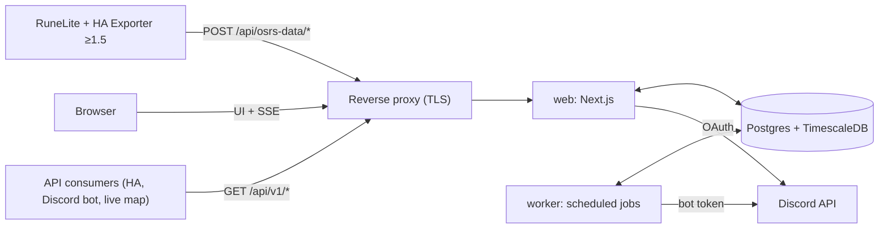

# Architecture

osrs-data-hub is a self-hostable web app for **one Discord guild**. It receives data from the
*HA Exporter* RuneLite plugin (v1.5+), aggregates it per OSRS account, shows it (dashboard, account and
guild pages, live toasts), and shares it (per-account, per-category permissions; a pull-only REST API
in Milestone 3).

This file is the living description of the system. The original design handoff is archived verbatim at
[`design/HANDOFF-draft2.md`](design/HANDOFF-draft2.md) and is referenced below as "handoff §N". Every
settled decision is recorded in the [decision log](#decision-log) with a stable ID (`D-12`); decisions
taken from the handoff say so, and decisions taken while building say why. Traps in the shared layer
live in [`gotchas/`](gotchas/README.md) and are cited by ID.

## Contents

1. [System context](#1-system-context)
2. [Repository layout](#2-repository-layout)
3. [Upstream protocol (HA Exporter v1.5)](#3-upstream-protocol-ha-exporter-v15)
4. [Identity, auth and membership](#4-identity-auth-and-membership)
5. [Devices and pairing](#5-devices-and-pairing)
6. [Ingest pipeline](#6-ingest-pipeline)
7. [Data model](#7-data-model)
8. [Retention and rollups](#8-retention-and-rollups)
9. [Permissions and privacy](#9-permissions-and-privacy)
10. [Live updates](#10-live-updates)
11. [Worker jobs](#11-worker-jobs)
12. [Configuration and operations](#12-configuration-and-operations)
13. [Milestones and status](#13-milestones-and-status)
14. [Decision log](#decision-log)

## 1. System context



| Service | Role |
|---|---|
| `web` | One Next.js app on the Node runtime: UI, auth, the plugin endpoints, the public API, the SSE stream. **One replica** (D-5). |
| `worker` | Long-running Node process running pg-boss scheduled jobs (§11). |
| `migrate` | One-shot container (the worker image) that applies DB migrations before `web` and `worker` start. |
| `db` | `timescale/timescaledb`, pinned to a Postgres major Timescale supports; Community features only. |
| `backup` | Optional nightly `pg_dump` with rotation (`ops/backup.sh`). |
| reverse proxy | Whatever the VM already runs. Must not buffer `text/event-stream`. |

There is no Redis. Rate limits and caches are in memory in the single `web` process; fan-out between
processes goes through Postgres `LISTEN/NOTIFY`.

## 2. Repository layout

```
apps/web            Next.js: UI, /api/osrs-data/* (plugin), /api/live/* (SSE), /api/v1/* (M3)
apps/worker         pg-boss jobs + the migrate entrypoint
packages/core       pure logic: payload schemas, version gate, time/staleness rules, event
                    normalization, derived-write planning, permission resolver, rate limiters, config
packages/db         Drizzle schema, migrations (incl. custom Timescale SQL), client, test DB helper
packages/server     DB-backed services shared by web and worker: ingest, pairing, devices, accounts,
                    sharing, Discord membership, live fan-out, offboarding
packages/fixtures   v1.5 plugin payloads (anonymized) used by tests
```

`packages/server` is an addition to the handoff layout (D-20): the handoff puts the ingest pipeline in
`packages/core`, but the pipeline needs the database, and keeping `core` free of I/O keeps every rule in
it unit-testable without Postgres.

## 3. Upstream protocol (HA Exporter v1.5)

The hub is a drop-in endpoint for the plugin's pairing and ingest protocol. The authoritative
description is handoff §3, verified against the plugin source at
`xXD4rkDragonXx/runelite-homeassistant-data-exporter@0ec2a36`; where the source and the handoff
disagree, the source wins and the difference is recorded here.

The protocol facts the hub relies on:

- `POST {base}/api/osrs-data/pair` with `{"code":"12345"}` and `X-Osrs-Exporter-Version`. A 2xx must
  carry a string `token`; an optional `name` becomes the connection name. Non-2xx may carry
  `{"error": "…"}`, which v1.5 shows to the player.
- `POST {base}/api/osrs-data/events` with `X-Osrs-Token` and the version header. The response body is
  ignored; only the status matters (handoff §3.2): 401 and 410 disable the connection, 429/503 pause it
  honouring `Retry-After` (events queue for up to 10 min, 50 payloads), other 4xx drop the payload,
  other 5xx back off exponentially.
- Payloads are Gson-serialized (nulls omitted). Every event has a UUID `eventId` and an epoch-ms
  `timestamp` from the player's PC clock. Resends reuse the same `eventId`.

## 4. Identity, auth and membership

- **Better Auth** with the Discord provider, the Drizzle adapter and database sessions (D-9). Scopes:
  `identify guilds.members.read`.
- **Sign-in gate:** `GET /users/@me/guilds/{GUILD_ID}/member` with the user's token. 404 → "not a member
  of <guild>"; if `DISCORD_REQUIRED_ROLE_IDS` is set the member needs at least one of them. Display
  name, avatar, nickname and roles are stored on the user.
- **Admin** = any role in `DISCORD_ADMIN_ROLE_IDS`, or listed in `ADMIN_DISCORD_USER_IDS`.
- **Re-verification** every 6 h (worker, bot token, `GET /guilds/{guild}/members/{user}`) and on every
  login. Only a *definitive* "unknown member" or a missing required role offboards; Discord errors and
  outages never do (fail open, alert after N consecutive failures).
- User states: `active` → `grace` → deleted (§11, handoff §14).

## 5. Devices and pairing

- **User** = a Discord identity. **Device** = one paired RuneLite connection = one token. **OSRS
  account** = a character identified by `accountHash`; accounts do not belong to users. One device can
  report many accounts and one account can be reported by several users' devices.
- **Pairing codes:** 5 digits, valid `PAIRING_CODE_TTL_SECONDS` (300), single-use, unique among active
  codes, at most 3 active per user.
- **Version gate:** `X-Osrs-Exporter-Version` is parsed numerically (`1.5`, `1.5.1`, `1.6-SNAPSHOT` →
  1.5.0 / 1.5.1 / 1.6.0) and compared with `MIN_PLUGIN_VERSION`. Missing or lower → 400 with an
  explanatory `error`, the code is **not** consumed, and the wizard is told (`outdated_plugin`) because
  older plugins don't show the error text.
- **Success:** `200 {"ok":true,"token":"<64 hex>","device_id":"<uuid>","name":"<HUB_NAME>"}`. Only
  `sha256(token)` is stored.
- **Rate limits on `/pair`:** 10 attempts per IP per 10 min, 60 per minute globally, temporary IP
  lockout after repeated failures. The code space is only 100k.

## 6. Ingest pipeline

`POST /api/osrs-data/events` is synchronous, one transaction per payload (handoff §7). Implemented in
`packages/server/src/ingest/`, with every decision rule in `packages/core`.

1. Decommission switch → 410. Authenticate `sha256(X-Osrs-Token)` → device → user; unknown/revoked
   device or inactive user → 401.
2. Version below minimum → `400 {"ok":false,"error":"plugin_outdated"}`; the device is flagged outdated.
3. Body over `INGEST_MAX_BODY_KB` → 413 (enforced while streaming, not from `Content-Length`).
4. Per-device token bucket (5/s, burst 30). Payloads carrying events always pass; snapshot-only payloads
   over the limit get `429` + `Retry-After: 3`.
5. The raw body is archived to `raw_payloads` outside the main transaction, and its final status is
   recorded afterwards.
6. Section-by-section lenient parsing: a malformed section or event is skipped and counted; the rest is
   processed.
7. Account resolution by `accountHash` (renames tracked in `account_names`), serialized per account with
   a transaction-scoped advisory lock.
8. Link user ↔ account (first reporter becomes owner; a blocked contributor's data is dropped with 200).
9. Presence always; special worlds update only live fields; staleness is judged **per device**.
10. Derived writes (XP samples, equipment changes, location samples, wealth, sessions), event insert with
    `ON CONFLICT DO NOTHING` on `(account_id, plugin_event_id, sub_index)`, `latest_state` upsert where a
    missing section keeps its previous value.
11. Commit; `pg_notify` inside the transaction is delivered on commit only.
12. 200 on success including all-duplicate payloads; 503 + `Retry-After: 30` on transient DB failures.

## 7. Data model

See handoff §8 for the logical model; the Drizzle schema in `packages/db/src/schema/` is the physical
one. Hypertables: `xp_samples`, `location_samples`, `raw_payloads`. Continuous aggregates: `xp_hourly`,
`xp_daily` (hierarchical).

## 8. Retention and rollups

| Data | Granularity | Kept for | Mechanism |
|---|---|---|---|
| `latest_state` | 1 row per account | while the account exists | upsert |
| `xp_samples` | 5 min, change-only, last value | `XP_RAW_RETENTION_DAYS` (365) | retention policy; compressed after 7 days |
| `xp_hourly` | 1 h, last value | forever | continuous aggregate |
| `xp_daily` | 1 day, last value | forever | hierarchical continuous aggregate |
| `events` | each event | forever | plain table |
| `play_sessions`, `equipment_changes`, `wealth_daily` | per change / per day | forever | plain |
| `location_samples` | ≤ 1 per minute | `LOCATION_RETENTION_DAYS` (30) | retention policy |
| `raw_payloads` | each payload | `RAW_PAYLOAD_RETENTION_HOURS` (72) | compressed after 6 h, retention |
| `audit_log` | each entry | `AUDIT_LOG_RETENTION_DAYS` (730) | worker |

XP only goes up, so every rollup takes the **last value per bucket, never an average**:
`xp_at(t)` = last sample at or before `t`, `gains(a, b) = xp_at(b) − xp_at(a)`.

## 9. Permissions and privacy

The plugin is the first privacy layer (players choose what is sent); the hub stores only what arrives,
never synthesizes events from snapshots, and shows unsent sections as "not shared". Sharing inside the
hub is the second layer:

| Category | Covers | Default |
|---|---|---|
| `stats` | skills, XP history, gains, levels | guild |
| `events` | loot, level-ups, deaths, collection log, diaries, combat tasks, superiors | guild |
| `activity` | online status, world, sessions and playtime, HP, prayer, spellbook | guild |
| `location_live` | current coordinates | private |
| `location_history` | the 30-day trail | private |
| `equipment` | current gear and its change log | private |
| `inventory` | current inventory and wealth history | private |

Viewing rule: owner or (non-blocked) contributor, OR audience `guild` and the viewer is active, OR
audience `selected` and a grant exists. Accounts whose owner is in `grace` without a transfer are hidden
from everyone except admins. `death.location` and `superiorSpawn.location` are redacted unless the viewer
can see `location_live` or `location_history`. One resolver in `packages/core` serves the UI, the SSE
filter and the API.

## 10. Live updates

`GET /api/live/stream` (session auth, SSE). The web process holds one `LISTEN` connection
(`hub_events`, `hub_state`, `hub_pairing`) and fans out to every open stream after the permission check
and the viewer's toast filter. Heartbeat comment every 25 s, `retry:` hint, `X-Accel-Buffering: no`,
`Last-Event-ID` replays the last 5 minutes; `/api/live/events?after=<seq>` is the polling fallback.
Toasts are skipped for events older than 15 minutes (they still reach the feed).

## 11. Worker jobs

| Job | Schedule |
|---|---|
| Close stale presence and sessions | every minute |
| Discord re-verification | every 6 h, staggered |
| Offboarding grace expiry | hourly |
| Re-apply Timescale policies from env | at startup |
| Clean up raw payloads | periodic (retention policy does the work) |
| Prune the audit log | daily |

## 12. Configuration and operations

All configuration is environment variables; see [`.env.example`](../.env.example) for the full list with
defaults, and [`OPERATIONS.md`](OPERATIONS.md) for deploys, backups and the reverse proxy.

## 13. Milestones and status

| Milestone | Scope | Status |
|---|---|---|
| M0 Scaffold | monorepo, compose, DB + Timescale migrations, CI, fixtures | in progress |
| M1 Ingest + onboarding | login + guild gate, pairing, ingest, wizard, devices, dashboard, toasts, default sharing | in progress |
| M2 History & sharing | charts, aggregates/retention, sessions, equipment, wealth, locations, sharing UI, guild page, re-verification/offboarding, admin basics | planned |
| M3 Public API | API keys, `/api/v1/*`, OpenAPI, cursor feed, `/snapshot` | planned |
| M4 Hardening | metrics dashboards, verified restores, export/delete, leaderboards, decommission switch | planned |

## Decision log

Decisions are permanent IDs; a reversed decision is marked superseded, never deleted or renumbered.
"Handoff" means the decision was settled in the design handoff before building started.

| ID | Decision | Why | Source |
|---|---|---|---|
| D-1 | Plugin **v1.5 is the minimum**; older versions are refused at pairing and ingest. | The hub relies on v1.5 guarantees: event ids, timestamps, stable account identity, backoff, nothing sent from special worlds by default. | Handoff §2, §6.2 |
| D-2 | One guild per deployment; another clan self-hosts by changing env vars. | Keeps auth and sharing simple. | Handoff §2 |
| D-3 | The public API is **pull-only**; no webhooks. SSE is internal to the hub's own UI. | Consumers poll `/snapshot` and the `/events` cursor feed. | Handoff §2, §13 |
| D-4 | Privacy follows the plugin: store only what arrives, never synthesize events or toasts from snapshots, show unsent sections as "not shared". | The player's plugin settings are the first privacy layer. | Handoff §2, §10 |
| D-5 | Docker Compose on one VM, **one `web` replica**, no Redis; rate limits and caches in memory; cross-process fan-out via `LISTEN/NOTIFY`. | Enough for one guild; adding replicas later only needs a shared rate limiter. | Handoff §4.1 |
| D-6 | TypeScript + pnpm workspaces; Next.js (App Router, route handlers on the Node runtime, never edge). | One language across web, worker and shared logic. | Handoff §4.2 |
| D-7 | Postgres + TimescaleDB Community (hypertables, compression, retention, continuous aggregates). | 10+ years of history with bounded storage. | Handoff §4.1, §9 |
| D-8 | Drizzle ORM + drizzle-kit; Timescale objects in **custom SQL migrations**. | Drizzle doesn't model hypertables or continuous aggregates. | Handoff §4.2 |
| D-9 | Better Auth with the Discord provider, Drizzle adapter, **database sessions**. | Auth.js is now part of Better Auth; DB sessions allow instant revocation. | Handoff §4.2 |
| D-10 | zod for validation: lenient section-by-section for plugin payloads, strict for our own API. | Unknown plugin fields pass through; one bad section never loses the rest. | Handoff §4.2, §7.1 |
| D-11 | pg-boss for scheduled jobs. | Postgres-backed; no extra infrastructure. | Handoff §4.2 |
| D-12 | Tailwind + shadcn/ui, sonner for toasts, a time-series-friendly chart library. | XP charts have many points. | Handoff §4.2 |
| D-13 | Vitest (unit + fixture-driven ingest tests) and Playwright (wizard e2e). | | Handoff §4.2 |
| D-14 | pino logs, `/api/health`, Prometheus `/metrics` (token-protected). | Fits the existing Grafana/Prometheus setup. | Handoff §4.2 |
| D-15 | Everything is keyed by the internal account id, resolved from `accountHash`; display names are history (`account_names`). | Name-keyed history merges accounts that swap names (ha-osrs-data lesson 3). | Handoff §3.6, §7.2 |
| D-16 | **No payload-level dedupe.** One mechanism: unique `(account_id, plugin_event_id, sub_index)`, kept forever; nothing is marked seen before commit. | Resends are legitimate; marking-before-processing lost data in ha-osrs-data (lesson 2). | Handoff §3.6, §7.4 |
| D-17 | Timestamps: `payload_ts = min(root.timestamp, recv)`; staleness only against the **same device's** last applied snapshot; `occurred_at = clamp(event.timestamp, recv − 15 min, recv)`; presence always refreshed. | Player clocks are wrong and differ between PCs (ha-osrs-data lesson 1). | Handoff §7.3 |
| D-18 | A missing section keeps its last value with its own `*_updated_at`; only `location` expires (2 min for live views). | Filtered sections must not be overwritten with empty values (ha-osrs-data lesson 4). | Handoff §3.6, §7.1 |
| D-19 | Status codes: 401 only for auth, 410 only for decommissioning, 429/503 + `Retry-After` for backpressure, 400 for bad input, 5xx only for transient faults. | Matches the plugin's `ConnectionBackoff` semantics; events queue for 10 min on 429/503. | Handoff §3.2, §7.7 |
| D-20 | Add `packages/server` for DB-backed services; `packages/core` stays free of I/O. | The handoff lists the ingest pipeline under `core`, but it needs the database; separating rules from I/O keeps every rule unit-testable. | Build |
| D-21 | Accounts don't belong to users: owner + contributors via `account_links`; first reporter becomes owner. | Shared accounts are expected. | Handoff §6.1 |
| D-22 | Seven sharing categories with defaults (stats/events/activity → guild; location, equipment, inventory → private); one resolver used by UI, SSE and API. | | Handoff §10 |
| D-23 | XP rollups use the last value per bucket; `xp_samples` is change-only at 5-minute buckets keyed on receive time, `xp = GREATEST(existing, new)`. | XP is monotonic; receive time avoids cross-PC clock skew. | Handoff §7.1, §9 |
| D-24 | An XP drop on a normal world skips the payload's XP writes. | Catches world types the hub doesn't know about. | Handoff §7.1 |
| D-25 | Offboarding: `active` → `grace` (30 days) → hard delete; devices, API keys and sessions revoked immediately; ownership transferred to the longest-linked active contributor, else the account is hidden. Discord errors never offboard. | | Handoff §5, §14 |
