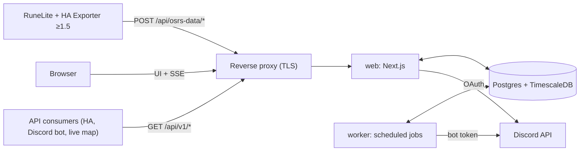

# Architecture

osrs-data-hub is a self-hostable web app for **one Discord guild**. It receives data from the
*HA Exporter* RuneLite plugin (v1.5+), aggregates it per OSRS account, shows it (dashboard, account and
guild pages, live toasts), and shares it (per-account, per-category permissions; a pull-only REST API
in Milestone 3).

This file is the living description of the system. The original design handoff is archived verbatim at
[`design/HANDOFF-draft2.md`](design/HANDOFF-draft2.md) and is referenced below as "handoff §N". Every
settled decision is recorded in the [decision log](#decision-log) with a stable ID (`D-12`); decisions
taken from the handoff say so, and decisions taken while building say why. Traps in the shared layer
live in [`gotchas/`](gotchas/README.md) and are cited by ID.

## Contents

1. [System context](#1-system-context)
2. [Repository layout](#2-repository-layout)
3. [Upstream protocol (HA Exporter v1.5)](#3-upstream-protocol-ha-exporter-v15)
4. [Identity, auth and membership](#4-identity-auth-and-membership)
5. [Devices and pairing](#5-devices-and-pairing)
6. [Ingest pipeline](#6-ingest-pipeline)
7. [Data model](#7-data-model)
8. [Retention and rollups](#8-retention-and-rollups)
9. [Permissions and privacy](#9-permissions-and-privacy)
10. [Live updates](#10-live-updates)
11. [Worker jobs](#11-worker-jobs)
12. [Web UI](#12-web-ui)
13. [Configuration and operations](#13-configuration-and-operations)
14. [Milestones and status](#14-milestones-and-status)
15. [Metrics](#15-metrics)
16. [Decision log](#decision-log)

## 1. System context



| Service | Role |
|---|---|
| `web` | One Next.js app on the Node runtime: UI, auth, the plugin endpoints, the public API, the SSE stream. **One replica** (D-5). |
| `worker` | Long-running Node process running pg-boss scheduled jobs (§11). |
| `migrate` | One-shot container (the worker image) that applies DB migrations before `web` and `worker` start. |
| `db` | `timescale/timescaledb`, pinned to a Postgres major Timescale supports; Community features only. |
| `backup` | Optional nightly `pg_dump` with rotation (`ops/backup.sh`). |
| reverse proxy | Whatever the VM already runs. Must not buffer `text/event-stream`. |

There is no Redis. Rate limits and caches are in memory in the single `web` process; fan-out between
processes goes through Postgres `LISTEN/NOTIFY`.

## 2. Repository layout

```
apps/web            Next.js: UI (§12), /api/app/* (the UI's routes), /api/osrs-data/* (plugin),
                    /api/live/* (SSE, §10), /api/v1/* (M3); Playwright e2e in apps/web/e2e
apps/worker         pg-boss jobs + the migrate entrypoint
packages/core       pure logic: payload schemas, version gate, time/staleness rules, event
                    normalization, derived-write planning, permission resolver, rate limiters, config
packages/db         Drizzle schema, migrations (incl. custom Timescale SQL), client, test DB helper
packages/server     DB-backed services shared by web and worker: ingest, pairing, devices, accounts,
                    sharing, Discord membership, live fan-out, offboarding
packages/fixtures   v1.5 plugin payloads (anonymized) used by tests
ops/                backup.sh; Prometheus config, scrape example and alert rules (ops/prometheus);
                    Grafana provisioning and dashboards as JSON (ops/grafana), D-85
```

`packages/server` is an addition to the handoff layout (D-20): the handoff puts the ingest pipeline in
`packages/core`, but the pipeline needs the database, and keeping `core` free of I/O keeps every rule in
it unit-testable without Postgres.

## 3. Upstream protocol (HA Exporter v1.5)

The hub is a drop-in endpoint for the plugin's pairing and ingest protocol. The authoritative
description is handoff §3, verified against the plugin source at
`xXD4rkDragonXx/runelite-homeassistant-data-exporter@0ec2a36`; where the source and the handoff
disagree, the source wins and the difference is recorded here. The RuneLite Plugin Hub serves v1.5
since 2026-09-29 (handoff §15 and open point §18.5 are settled), so players install it normally.

The protocol facts the hub relies on:

- `POST {base}/api/osrs-data/pair` with `{"code":"12345"}` and `X-Osrs-Exporter-Version`. A 2xx must
  carry a string `token`; an optional `name` becomes the connection name. Non-2xx may carry
  `{"error": "…"}`, which v1.5 shows to the player.
- `POST {base}/api/osrs-data/events` with `X-Osrs-Token` and the version header. The response body is
  ignored; only the status matters (handoff §3.2): 401 and 410 disable the connection, 429/503 pause it
  honouring `Retry-After` (events queue for up to 10 min, 50 payloads), other 4xx drop the payload,
  other 5xx back off exponentially. Up to plugin 1.6.1 a 404 is one of those 4xx and only payloads with
  events queue; plugin PR 45 (unmerged on 2026-10-06) backs off on a 404 as on a 5xx (PLUGIN-2) and
  also queues snapshots that carry trail points (PLUGIN-3).
- Payloads are Gson-serialized (nulls omitted). Every event has a UUID `eventId` and an epoch-ms
  `timestamp` from the player's PC clock. Resends reuse the same `eventId`.
- **v1.5.1** (`@9835dbe`, header `1.5.1`) adds one field: `player.inventory.items[].inventorySlot`, the
  slot 0..27 (left to right, then top to bottom). Empty slots are still omitted; equipment, loot and
  death kept/lost items never carry it. The hub places the inventory grid by it and still accepts 1.5
  (D-86, PLUGIN-11).
- **v1.6** (`@2a5b33a`, header `1.6.0`) adds `player.locationTrail`, right after `location`: every tile
  the player was on since the previous message, oldest first, each `{x, y, plane, isOnBoat, timestamp}`
  with the PC clock's epoch ms. One point per game tick on which the tile, plane or boat state changed,
  each put in one message, at most 300 per message, `[]` when the player stood still; the Share location
  switch removes it together with `location`. Whether the points of a message that failed to deliver
  still arrive depends on the plugin: up to 1.6.1 it sends the message again only when it carries
  events, plugin PR 45 (unmerged on 2026-10-06) also when it carries trail points, with queued snapshots
  combined into one. Nothing marks a teleport: two consecutive points far apart
  were not walked. The hub stores the points as its location trail and still accepts 1.5 (D-102),
  and says how each point was reached when the trail is read (D-103).

## 4. Identity, auth and membership

- **Better Auth** with the Discord provider, the Drizzle adapter and database sessions (D-9). Scopes:
  `identify guilds.members.read`.
- **Sign-in gate:** `GET /users/@me/guilds/{GUILD_ID}/member` with the user's token. 404 → "not a member
  of <guild>"; if `DISCORD_REQUIRED_ROLE_IDS` is set the member needs at least one of them. Display
  name, avatar, nickname and roles are stored on the user.
- **Admin** = any role in `DISCORD_ADMIN_ROLE_IDS`, or listed in `ADMIN_DISCORD_USER_IDS`.
- **Re-verification** every 6 h (worker, bot token, `GET /guilds/{guild}/members/{user}`) and on every
  login. Only a *definitive* "unknown member" or a missing required role offboards; Discord errors and
  outages never do (fail open, alert after N consecutive failures).
- User states: `active` → `grace` → deleted (§11, handoff §14).

## 5. Devices and pairing

- **User** = a Discord identity. **Device** = one paired RuneLite connection = one token. **OSRS
  account** = a character identified by `accountHash`; accounts do not belong to users. One device can
  report many accounts and one account can be reported by several users' devices.
- **Pairing codes:** 5 digits, valid `PAIRING_CODE_TTL_SECONDS` (300), single-use, unique among active
  codes, at most 3 active per user.
- **Version gate:** `X-Osrs-Exporter-Version` is parsed numerically (`1.5`, `1.5.1`, `1.6-SNAPSHOT` →
  1.5.0 / 1.5.1 / 1.6.0) and compared with `MIN_PLUGIN_VERSION`. Missing or lower → 400 with an
  explanatory `error`, the code is **not** consumed, and the wizard is told (`outdated_plugin`) because
  older plugins don't show the error text.
- **Success:** `200 {"ok":true,"token":"<64 hex>","device_id":"<uuid>","name":"<HUB_NAME>"}`. Only
  `sha256(token)` is stored.
- **Rate limits on `/pair`:** 10 attempts per IP per 10 min, 60 per minute globally, temporary IP
  lockout after repeated failures. The code space is only 100k.
- **Decommissioned hub:** `/pair` answers 410 before anything else, as ingest does (D-56).

## 6. Ingest pipeline

`POST /api/osrs-data/events` is synchronous, one transaction per payload (handoff §7). Implemented in
`packages/server/src/ingest/`, with every decision rule in `packages/core`.

1. Decommission switch → 410. Authenticate `sha256(X-Osrs-Token)` → device → user; unknown/revoked
   device or inactive user → 401. The transaction checks again under row locks, so a revoke or an
   offboarding that commits while the payload is in flight also ends in 401 (D-55).
2. Version below minimum → `400 {"ok":false,"error":"plugin_outdated"}`; the device is flagged outdated.
3. Body over `INGEST_MAX_BODY_KB` → 413 (enforced while streaming, not from `Content-Length`).
4. Per-device token bucket (5/s, burst 30). Payloads carrying events always pass; snapshot-only payloads
   over the limit get `429` + `Retry-After: 3`, and so do unparsable bodies, which are then not archived
   (D-57). A plugin up to 1.6.1 drops the refused snapshot and those it builds during the pause, trail
   points included; plugin PR 45 (unmerged on 2026-10-06) keeps the ones that carry trail points and
   sends them after the pause. Its retry queue goes through the same bucket: a drain of more than about
   30 queued payloads without events empties it (30, refilled 5 a second), gets a `429` with
   `Retry-After: 3` and goes on after the pause; nothing is lost.
5. The raw body is archived to `raw_payloads` outside the main transaction, and its final status is
   recorded afterwards.
6. Section-by-section lenient parsing: a malformed section or event is skipped and counted; the rest is
   processed.
7. Account resolution by `accountHash` (renames tracked in `account_names`), serialized per account with
   a transaction-scoped advisory lock.
8. Link user ↔ account (first reporter becomes owner; a blocked contributor's data is dropped with 200).
9. Presence always; special worlds update only live fields; staleness is judged **per device**. A stale
   snapshot still stores the points of its location trail (D-102).
10. Derived writes (XP samples, equipment changes, location points, wealth, sessions), event insert with
    `ON CONFLICT DO NOTHING` on `(account_id, plugin_event_id, sub_index)`, `latest_state` upsert where a
    missing section keeps its previous value.
11. Commit; `pg_notify` inside the transaction is delivered on commit only. Deadlocks and racing
    unique inserts are retried in-process (D-49, TSDB-12); transactions that may create a hypertable
    chunk take one shared advisory lock first, so chunk creation never deadlocks (D-58).
12. 200 on success including all-duplicate payloads; 503 + `Retry-After: 30` on transient DB failures.

## 7. Data model

See handoff §8 for the logical model; the Drizzle schema in `packages/db/src/schema/` is the physical
one. Hypertables: `xp_samples`, `location_samples`, `raw_payloads`. Continuous aggregates: `xp_hourly`,
`xp_daily` (hierarchical). The official hiscores (D-105) are three plain tables: `account_hiscores` (the
latest lookup per account), `activity_scores` (the change log of kill counts and other scores, with a
`baseline` flag) and `hiscore_xp_fills` (which `xp_samples` rows came from the hiscores). Metrics adds
one: `account_goals` (D-109), an owner's targets per account (§15).

## 8. Retention and rollups

| Data | Granularity | Kept for | Mechanism |
|---|---|---|---|
| `latest_state` | 1 row per account | while the account exists | upsert |
| `xp_samples` | 5 min, change-only, last value | `XP_RAW_RETENTION_DAYS` (365) | retention policy; compressed after 7 days |
| `xp_hourly` | 1 h, last value | forever | continuous aggregate |
| `xp_daily` | 1 day, last value | forever | hierarchical continuous aggregate |
| `events` | each event | forever | plain table |
| `play_sessions`, `equipment_changes`, `wealth_daily` | per change / per day | forever | plain |
| `account_hiscores` | 1 row per account | while the account exists | upsert (D-105) |
| `activity_scores`, `hiscore_xp_fills` | per change of a score / per filled XP sample | forever | plain (D-105) |
| `account_goals` | per goal (at most 20 per account) | until removed, or with the account | plain (D-109) |
| `location_samples` | every tile visited (plugin 1.6); ≤ 1 per minute from older plugins and while standing still (D-102) | `LOCATION_RETENTION_DAYS` (30) | retention policy; compressed after 1 day |
| `raw_payloads` | each payload | `RAW_PAYLOAD_RETENTION_HOURS` (72) | compressed after 6 h, retention |
| `audit_log` | each entry | `AUDIT_LOG_RETENTION_DAYS` (730) | worker |

XP only goes up, so every rollup takes the **last value per bucket, never an average**:
`xp_at(t)` = last sample at or before `t`, `gains(a, b) = xp_at(b) − xp_at(a)`.

Activity scores are not XP: a score is unknown until it reaches the hiscores' threshold (5 kills for
most bosses), and a renamed account's series can't be joined to the old one. So a gain is the
difference between two `activity_scores` rows **of one series**, and a `baseline` row starts a new
series: never a gain up to it (D-105).

## 9. Permissions and privacy

The plugin is the first privacy layer (players choose what is sent); the hub stores only what arrives,
never synthesizes events from snapshots, and shows unsent sections as "not shared". The one thing it
adds is public: the official hiscores (D-105), read by the hub itself, of which only XP the plugin
didn't report reaches the XP history. Sharing inside the hub is the second layer:

| Category | Covers | Default |
|---|---|---|
| `stats` | skills, XP history, gains, levels | guild |
| `events` | loot, level-ups, deaths, collection log, diaries, combat tasks, superiors | guild |
| `activity` | online status, world, sessions and playtime, HP, prayer, spellbook | guild |
| `location_live` | current coordinates | guild (D-82) |
| `location_history` | the trail of past positions, tile by tile (D-102; kept `LOCATION_RETENTION_DAYS`) | guild (D-96) |
| `equipment` | current gear and its change log | guild (D-96) |
| `inventory` | current inventory and wealth history | guild (D-96) |
| `hiscores` | ranks, boss kill counts, clues and minigames from the official hiscores, and their history | guild (D-105) |

Every category defaults to the guild since D-96 (live location since D-82). An account the hub knew
before a default changed is pinned to `private` for that category by a migration (`0004` for live
location, `0007` for the other three), so neither change exposed anything that was private; only
accounts first seen afterwards get the new default. Because everything is shared from the start, the
pairing wizard's last step shows the owner the account's sharing controls (§12). Death and superior
coordinates follow the location categories, so a guild member sees them by default too.

Viewing rule: owner or (non-blocked) contributor, OR audience `guild` and the viewer is active, OR
audience `selected` and a grant exists. Accounts whose owner is in `grace` without a transfer are hidden
from everyone except admins. An owner can also **hide an account from the guild**
(`osrs_accounts.hidden_from_guild`, D-104): then only the owner and contributors see it, whatever its
audiences and grants say (they are kept for when it is shown again); an admin keeps only the override
to manage it, and the guild page doesn't list it for them. `death.location` and `superiorSpawn.location` are redacted unless the viewer
can see `location_live` or `location_history`. One resolver in `packages/core` serves the UI, the SSE
filter and the API. Besides a signed-in user, the resolver takes the **guild audience** as a principal
(`GUILD_AUDIENCE`, D-89): an active member with no relation to any account, so it sees exactly the
categories whose audience is `guild`. Service keys (D-88) act as it.

## 10. Live updates

**Server.** `GET /api/live/stream` (session auth, SSE; 401 JSON when signed out). The web process
holds one `LISTEN` connection (`hub_events`, `hub_state`, `hub_pairing`; started by
`instrumentation.ts`, reconnecting with a backoff) and one `LiveHub` (`packages/server/src/live/`), both
on `globalThis` (D-37). Ingest and pairing call `pg_notify` inside their transaction, so only committed
data is announced (D-32). The hub fans each notification out to every open stream after the
permission check (`resolveAccess`, D-22) and the viewer's toast filter, and drops the streams of users
who are no longer active. Messages:

| Message | To whom | Carries |
|---|---|---|
| `event` (`id:` = the event's `seq`) | viewers who may read the account's `events` | the redacted feed event and a `toast` flag (the viewer's filter; never for events older than 15 minutes) |
| `presence` | viewers with the account's `activity` | online, world, special world, last seen, `onlineForMs` |
| `pairing` | the user who created the code | `consumed` (with the device) or `outdated_plugin` (with the version) |
| `device` | the device's user | the first data from a newly paired device (account, owner or contributor) |
| `resync` | one stream | "refetch": after the `LISTEN` connection reconnected, or a replay cut off at its limit |

The stream starts with `retry: 5000`, writes a heartbeat comment every 25 s and re-checks the Better
Auth session on each one (a stream whose session is gone ends; the browser's reconnect then gets 401),
and sends `X-Accel-Buffering: no` and `Cache-Control: no-cache, no-transform`. A reconnect carrying
`Last-Event-ID` (or `?lastEventId=`) first replays the viewer's events of the last 5 minutes after that
seq, at most 200, then a `resync` if it was cut off (D-65); live messages arriving meanwhile are held
back so seqs stay ascending. A first connection never replays, since that would toast old events. A user holds at most 5 streams per process (`LIVE_MAX_STREAMS_PER_USER`); the next answers 429
`rate_limited` + `Retry-After: 30`, and the browser falls back to polling and reopens at most once a
minute (D-80).

`GET /api/live/events?after=<seq>` is the polling fallback. Without `after`, it answers no events and
the current *settled* cursor: the newest seq below any row inserted in the last 10 s, since `seq` is
taken at insert and a lower one can still commit after a higher one (DB-4). With `after` (0 included:
a hub without events hands out 0) it answers the viewer's settled events after it from the last
5 minutes and the next cursor (D-65).

**Browser.** One `LiveProvider` (apps/web `components/live/`) per signed-in page tree owns the
connection. It reopens a stream the browser gave up on with a backoff (5 s → 60 s), polls every 10 s
while the stream isn't open, de-duplicates events by id (replay and polling overlap the stream), and
reopens the stream with `?lastEventId=` when the toast filter changes, because the server captures the
filter when a stream opens. Presence messages carry `onlineForMs`, and the client marks an account
offline after that long without another message, since nothing is sent when a client crashes. A
`resync` refreshes the server components (and reopens the stream at most once a minute); a 401 from
the poll refreshes, which sends the browser to `/login`. Toasts (sonner) appear top right, below the
sticky header. The stream is also the route that renews the session cookie for an active user (D-64).

## 11. Worker jobs

| Job | Schedule |
|---|---|
| Close stale presence and sessions (`close-stale-sessions`) | every minute |
| Discord re-verification (`reverify-members`): a batch of users last checked over 6 h ago (D-43), two circuit breakers (D-62); off, with a warning at startup and on each run, without `DISCORD_BOT_TOKEN` and `DISCORD_GUILD_ID` | every 15 min |
| Offboarding grace expiry, then the orphaned-account purge (`expire-grace`, D-61) | hourly |
| Official hiscores lookups (`sync-hiscores`, D-105): the accounts due, one request at a time at most every `HISCORES_REQUEST_INTERVAL_MS`, for at most 45 s a run; a push-back pauses every lookup; off without `HISCORES_URL` | every minute |
| Prune the audit log (`prune-audit-log`) | daily |
| Re-apply Timescale policies from env (D-40) | at startup |
| Clean up raw payloads | the retention policy does the work; no job |

Every queue uses pg-boss's `stately` policy, so runs never overlap or pile up (D-63), and a failed job is
logged and stored with its SQLSTATE and Postgres message only (DB-3). Every run is also timed and counted
(`hub_job_duration_seconds`, `hub_job_runs_total{job_name,result}`,
`hub_job_last_success_timestamp_seconds`), and the worker serves its metrics on `WORKER_METRICS_PORT`
(D-84). A re-verification run skipped for missing Discord config is not a run and isn't counted. The worker stops cleanly on
SIGTERM (pg-boss graceful stop, then the pool).

## 12. Web UI

The pages of handoff §12, built with the Next.js App Router (server components by default, `'use client'`
only where a page is interactive), Tailwind v4 and shadcn/ui, lucide icons, sonner toasts, and ECharts
behind one client-only wrapper (`components/charts/echart.tsx`, `next/dynamic` with `ssr: false`) that
reads the theme's CSS variables. Dark mode follows the OS, with System / Light / Dark in the account
menu (`next-themes`). Every page works at phone width.

**Where the code lives** (under `apps/web/src`). `app/` holds what Next.js looks for there (pages,
layouts, loading and error files, route handlers), the routes' own helpers and their tests; anything a
second feature imports lives under `components/` or `lib/`, not beside a `page.tsx`.
`components/` has a folder per feature (`account-page/`, `admin/`, `api-keys/`, `devices/`, `guild/`,
`onboarding/`, `settings/`, `sharing/`) and the shared ones:

| Folder | What belongs there |
|---|---|
| `components/shell/` | The app frame only: header, navigation, user menu, theme provider, live status, auto-refresh, page header, hub mark. |
| `components/common/` | Hand-written building blocks any page uses: `SectionCard`, `CardSkeleton`, `Stat`, `StatusPage`, `ConfirmAction`, `CopyButton`, `UserAvatar`, `SkillSelect`, `FieldError`, `NativeSelect`. |
| `components/accounts/` | The account widgets used everywhere (link, card, presence, badges). Not `account-page/`, which holds the account page's own sections. |
| `components/time/` | Clock-dependent display: the shared `useNow` clock and `RelativeTime`. |
| `components/events/`, `charts/`, `icons/`, `live/` | Shared by subject: event feed and timeline, the chart wrapper and option builders, game icons, the live stream client. |
| `components/ui/` | shadcn-generated files and nothing else; ESLint skips the folder, so hand-written code there would go unchecked. |
| `lib/` | Helpers without React: the API client, guards, dates, focus, sessions, the public API's plumbing. |

A rule or limit that both a route handler and a component need lives in `lib/` (`lib/admin-rules.ts`),
never in a component's model file: route handlers import nothing from `components/`. A limit defined
in `@hub/server` (name and label lengths, active keys and pairing codes, the delete confirmation word)
reaches a client component as a prop from its server component page, never as a copy of the number.

**Game icons (D-95).** Items, skills and empty equipment slots show the game's own icons, from the
central [osrs-icons](https://github.com/RedFirebreak/osrs-icons) CDN at `OSRS_ICONS_URL` (default
`https://icons.scapekeeper.com`; empty = icons off, names only). The (app) layout reads the base URL at
request time and hands it to `IconConfigLoader`, which has the browser fetch the CDN's stack tables
(`/data/stacks.json`, which picture shows a quantity, e.g. a coin pile) once per page load, from its
HTTP cache after the first; a failure means base pictures only. So the tables never hold up a render
or ride along in every RSC payload (the home page refreshes each minute), and a stacked item leaves an
empty box until they arrive rather than showing one coin and swapping. The icons
are plain `` leaves (`components/icons/osrs-icon.tsx`: `ItemIcon`, `SkillIcon`, `SlotIcon`,
`EventGameIcon`) that render the text or lucide icon the page showed before whenever there is no icon
(icons off, Overall, a 404 from the CDN, a failed load), so nothing depends on the CDN being up. Where
they appear: inventory and equipment tiles (with the in-game stack label over the picture), the "Most
valuable" list, the skills table, event feeds and live toasts (the event's item, else its skill). The
toast renders in the root layout's Toaster, outside the provider, so the LiveProvider passes the
configuration to `showEventToast`, which provides it again around `EventGameIcon`. lucide stays for everything that isn't a game object.

| Page | What it shows |
|---|---|
| `/login` | Discord sign-in, with a message for each refusal (`not_guild_member`, `missing_role`, `discord_unavailable`, `access_revoked`, a cancelled consent); a user in grace sees it too. With `?deleted=<date>` (after Delete my data) it says when the data goes (UTC) and that signing in again cancels it. The page says who it is for (members of `DISCORD_GUILD_NAME` only), that the sign-in happens at discord.com, that the hub never asks for a RuneScape or Jagex login, and that sharing game data is opt-in (nothing is sent until the plugin is installed and paired); its meta description names the first three. The footer of the sign-in layout links to `/privacy`, scapekeeper.com and the source on GitHub and says the hub is not affiliated with Jagex. A visitor, or a reviewer judging whether a guild's sign-in page is phishing, has to be able to tell what the site is without signing in. |
| `/` (dashboard) | "Online now" (live), a card per own account (presence, total level, overall XP, gains today and 7 days, the last five events), and an empty state that points at the wizard. |
| `/onboarding` | The pairing wizard (handoff §6.3): Install → Pair (a 5-digit code and the base URL from `APP_URL`) → First data → Done. The Done step shows the account's owner who can see it, with the account page's per-category sharing controls (D-96); a contributor is told the owner decides. Progress arrives as live `pairing` and `device` messages, with a poll of every code the plugin may still use (every 3 s while the stream is down, every 15 s as a safety net). An outdated plugin is named with its version, since older plugins don't show the hub's error text. A reload resumes the code kept in `?code=<id>`: the same code while it is active, step 3 for a consumed one, a new code only when it expired. |
| `/devices` | Paired devices: label (renamable), plugin version, outdated warning, last seen, accounts; revoke. |
| `/accounts/[publicId]` | Header (type, live presence, owner, previous names), skills table (real level with the virtual one beside it, D-44; gains today/7/30/365 days), XP chart, sessions and playtime per local day, events timeline (type filters, "load more", live), vitals, live location as text, gear by slot with its change log, the inventory as the in-game 28-slot grid (D-86), wealth per day, and the sharing panel ("Hide from the guild" (D-104), audiences, grants, block/unblock/remove, transfer, claim; D-52). |
| `/accounts/[publicId]/metrics` | The Metrics tab (§15, D-106): totals of a range, a chosen session's timeline, the period comparison, the effective-hours heatmap, the sessions scatter, the rate through a session, where the time goes, session recaps with records, skills with XP/h and time to level, bosses, goals. Filters in the URL. |
| `/accounts/[publicId]/metrics/bosses/[activity]` | One boss (D-108): kill count and ranks, kills per day or week, loot against kills, loot per kill, uniques and the kills since the last one, best drops, sessions with the time per kill. `hiscores` required (404 otherwise). |
| `/guild` | Members with their visible accounts and live online dots (only accounts the viewer plays or may read something of: an account an admin sees only through the override, every category private or hidden from the guild, isn't listed; D-104), the activity feed, gains leaderboards per period and skill, and boss leaderboards (kills gained over 7 or 30 days, D-110). The activity feed leaves out what the admin's guild feed filter excludes (loot below a minimum value, level-ups past 99; D-81), in its pages and its live events alike. |
| `/settings` | Toast filter (types, minimum loot value), time zone, **Download my data** (a link to `GET /api/app/export`, D-79) and **Delete my data** (type `delete` to confirm; `POST /api/app/me/delete`, D-78). |
| `/api-keys` | The user's API keys (name, `ohub_<prefix>_…`, categories, scope, created, last used, expiry, status) with Edit (name, categories, accounts; D-111) and Revoke, Delete for revoked and expired keys, and "Create key" (categories, every visible account or picked ones, expiry; the key shown once with Copy). D-69, D-76. |
| `/docs/api` | Public: the interactive API reference (Scalar from jsDelivr at a pinned version with SRI) over `/api/v1/openapi.json` (D-75). |
| `/privacy` | Public: what is stored and for how long (from the configuration), the sharing defaults, what admins can see, what returning to the guild restores. What the export holds and leaves out, and the 7-day undo of Delete my data. |
| `/icon.svg` | Public: the favicon, the header's mark (`HubMark`) as an SVG. It is `app/icon.svg`, Next's file convention, which also links it from every page. It lies outside `(app)` and no middleware or proxy runs in front of the routes, so the sign-in page gets it without a session. |
| `/admin/*` | Users (offboard, restore), devices (revoke), integrations (the service keys of the public API, D-88: name, `ohub_<prefix>_…`, categories, rate limit, creator, status; Edit (name, categories, rate limit) and Revoke, Delete once revoked or expired, D-111; and "Create integration key" with the key shown once), ingest health (rates, with rejected payloads per minute, D-83; rejections since start), raw payloads (filters and an audited viewer), audit log, settings (the guild feed filter, D-81), configuration (secrets redacted), decommission switch. |

Rules every page and route follows:

- **Access.** Every page under `(app)` calls `requireUser()` (the layout does too, but a layout isn't
  re-rendered on client navigation); signed-out and grace users go to `/login`. Admin pages call
  `requireAdmin()`, which answers 404 to everyone else. An account the viewer may not see, an unknown
  one and an id that can't be one (checked before any query, since Postgres refuses NUL, DB-1) all
  answer the same 404. A section the viewer may not see isn't rendered at all; one the plugin didn't
  send says "Not shared" (D-4). Stamps of viewers without `activity` are day-only (D-50). The not-found
  check comes before anything streams: no segment `loading.tsx` above a page that can call
  `notFound()`; its slow parts render in `<Suspense>` after the check, so the answer is a real 404
  (NEXT-14).
- **Focus.** When a dialog or menu closes after an action that removes, disables or re-renders its
  trigger, focus moves to a stable element, normally the heading of the section the trigger was in
  (`lib/focus.ts`, `useFocusReturn`); a dialog without a trigger returns focus itself.
- **Data.** Pages and routes read and write through `@hub/server` only (with `getDb()` handed in);
  client components never value-import `@hub/server` or `@hub/db`, and `@hub/core` is side-effect free
  so a client import of one helper doesn't ship its Node-only modules (D-67, NEXT-12).
- **Mutations** are route handlers under `/api/app/*` (D-36): Origin check first (`assertSameOrigin`,
  403), then `requireApiUser` (401) or the admin guard (403), then a body capped at 64 KiB (413) and
  parsed strictly (400). Errors are mapped by `handleApi`: database outages and Better Auth 5xx are
  503 + `Retry-After` (AUTH-13), everything unexpected a 500 that leaks nothing.
- **Sessions** are renewed only by route handlers; page renders read them with `disableRefresh`
  (AUTH-12, D-64). A database error while a page checks the session shows the error page rather than
  `/login`. Better Auth's own log lines go through pino without error objects (AUTH-13).
- **URLs.** Absolute URLs come from `APP_URL` (D-26), never from `request.url` (NEXT-2); links are
  checked by `typedRoutes`, with `as Route` only for strings built at run time.
- **Public API.** `/api/v1/*` handlers run inside `withApiKey` (`lib/api-v1`): bearer keys only (cookies
  are never read), the failed-authentication limit per client IP before any database access, one 401 for
  every refused key, the per-key limits (each key's own requests per minute, D-88), then the handler
  inside `handleApi` (D-70 … D-72). A user key acts as its creator, a service key as the guild audience
  (D-89); the read models never branch on the kind except for what the response carries (`account_hash`,
  D-91; the bulk caps, D-92) and for `/members/{discord_id}`, which exists for service keys only
  (D-100). Every response carries the CORS headers. Query parameters and responses are zod schemas
  (`lib/api-v1/schemas.ts`) that also generate the OpenAPI document and check the route tests'
  responses; `lib/api-v1/wire.ts` maps each read model to snake_case (D-77). Consumer guide:
  [API.md](API.md).
- **Navigation.** The header shows the full navigation from the `lg` breakpoint (1024 px); narrower
  screens get the menu button, so six labelled items never wrap.
- **Tables.** Rows that carry a date are listed newest first. A chart keeps time running left to
  right; its "Show as table" alternative is sorted by `ChartWithTable` itself, whatever order the rows
  come in, so every per-day chart follows the rule.

The web app's Vitest project covers every route handler and page-level access rule against a real
database; Playwright covers the wizard end to end (`pnpm test:e2e`, D-13) and takes screenshots of every
page for visual review (`E2E_SCREENSHOTS=1`); see [DEVELOPMENT.md](DEVELOPMENT.md).

## 13. Configuration and operations

All deployment configuration is environment variables; see [`.env.example`](../.env.example) for the full list with
defaults, and [`OPERATIONS.md`](OPERATIONS.md) for deploys, backups and the reverse proxy.
Options an admin changes at run time live in `hub_settings` (key → jsonb) and are audited: the
decommission switch (D-56) and the guild feed filter (D-81), both on the admin pages.
The worker's hiscores lookups (D-105) read `HISCORES_URL` (default `https://secure.runescape.com`;
empty turns them off) and `HISCORES_REQUEST_INTERVAL_MS` (default 3000, at least 1000).

**Monitoring.** Two Prometheus endpoints, both behind `METRICS_TOKEN` (404 without it, 401 without the
bearer token): the web service's `GET /metrics` and the worker's (D-84). Both processes build the same
metric set (`packages/server/src/metrics.ts`); a series only moves in the process that does the work, so
queries sum over both. Labels come from fixed sets in the code, never ids, names, addresses or
coordinates (D-53). The Grafana dashboard and the alert rules are files in `ops/` for the operator's own
Prometheus and Grafana (D-85); the hub never links to them. The in-app view for admins stays the Ingest
health page, which reads the web process's registry and the database directly.

| Area | Metrics (`hub_…`) | Process |
|---|---|---|
| Ingest | `ingest_payloads_total{status}`, `ingest_events_total{type}`, `ingest_duplicate_events_total`, `ingest_skipped_sections_total`, `ingest_skipped_events_total`, `ingest_ignored_total{reason}`, `ingest_duration_seconds`, `plugin_requests_by_version_total{version}` | web |
| Live and pairing | `sse_connections`, `live_streams_refused_total`, `pair_attempts_total{result}` | web |
| Public API | `api_requests_total{group,status}`, `api_request_duration_seconds{group}`, `api_rate_limited_total{limit}`, `api_auth_failures_total{reason}` | web |
| Data rights | `data_exports_total{result}`, `offboarded_users_total{reason}` (`self_delete` = Delete my data) | web (and worker for re-verification) |
| Discord | `discord_verify_checks_total{verdict}`, `discord_verify_failures_total{kind}`, `discord_verify_breaker_trips_total{rule}` | worker |
| Official hiscores | `hiscore_lookups_total{result}` (`ok`, `not_found`, `mismatch`, `throttled`, `error`), `hiscore_xp_fills_total` | worker |
| Players and retention | `play_sessions_open`, `play_sessions_timed_out_total`, `grace_expired_users_total`, `accounts_deleted_total{cause}` | worker |
| Jobs | `job_duration_seconds{job_name}`, `job_runs_total{job_name,result}`, `job_last_success_timestamp_seconds{job_name}` | worker |
| Process | prom-client's defaults with the `hub_` prefix | both |

## 14. Milestones and status

| Milestone | Scope | Status |
|---|---|---|
| M0 Scaffold | monorepo, compose, DB + Timescale migrations, CI, fixtures | done; the fixtures are built from the plugin source (`0ec2a36`), not yet captured from a live client (the Plugin Hub serves 1.5 since 2026-09-29) |
| M1 Ingest + onboarding | login + guild gate, pairing, ingest, wizard, devices, dashboard, toasts, default sharing | done, with the wizard e2e test |
| M2 History & sharing | charts, aggregates/retention, sessions, equipment, wealth, locations, sharing UI, guild page, re-verification/offboarding, admin basics | done; the 30-day location trail is stored and served (`/api/app/accounts/[id]/locations`) but not drawn |
| M3 Public API | API keys, `/api/v1/*`, OpenAPI, cursor feed, `/snapshot` | done: keys, key access and a read model per endpoint (`packages/server/src/api/`); every `/api/v1` endpoint of handoff §13 behind one bearer-key wrapper, snake_case JSON through typed mappers (D-77), CORS, OpenAPI 3.1 at `/api/v1/openapi.json`, the Scalar reference at `/docs/api`, the API keys page; consumer guide in [API.md](API.md). Additions for the guild live map (D-88 … D-94): service keys, owner identity, `account_hash`, bulk `/xp` and `/locations`, `game_state` on `/snapshot` and the loot leaderboard `/leaderboards/loot` (D-94), events in a time range on `/events` (D-98), the membership verdict `/members/{discord_id}` (D-100); a key-authenticated stream is deferred (D-93) |
| M4 Hardening | metrics dashboards, verified restores, export/delete, leaderboards, decommission switch | partly: gains leaderboards (guild page), the decommission switch (D-56), download my data (D-79), delete my data (D-78) and metrics dashboards are built: `/metrics` on web and worker (D-84), the Hub overview dashboard, alert rules and a local Prometheus + Grafana stack (D-85). A verified restore is not |

## 15. Metrics

A RuneMetrics-style view of each guild account (D-106): not "what just happened" but "how am I doing,
where does my time go, and when am I actually effective". Three places carry it: a **Metrics** tab on
the account page (`/accounts/[publicId]/metrics`; `/metrics` is the Prometheus endpoint, D-84), a page
per boss, and boss leaderboards on the guild page. Nothing new is collected: it reads XP, play
sessions, loot events, the hiscores' kill counts and wealth. The one new table is `account_goals`.

**Layers.** Pure logic in `packages/core/src/metrics/`: the session model and effective time
(`sessions.ts`), the period comparison (`comparison.ts`), the URL query (`query.ts`), levels
(`levels.ts`), local clocks (`clock.ts`) and boss name matching (`bosses.ts`). The read models in
`packages/server/src/account-metrics/` read the rows and hand them in as numbers (`getAccountMetrics`,
`getBossMetrics`, `getBossLeaderboards`, goals). The pages render one server-computed view; the
charts' options are built in `apps/web/src/components/metrics/chart-options.ts` and unit-tested.

**Effective time (D-107).** A 5-minute bucket of a session (the resolution of `xp_samples`) is
**active** when the account gained XP in it from the plugin or, for a viewer who may read `events`, had a
drop; otherwise idle. Effective share = active ÷ online. Rates are given over active and online time
side by side. XP the hiscores filled in (D-105) was made outside any session: it counts in the period
totals and the comparison, never as an active bucket. A bucket that touches two sessions is counted
once.

**Kills (D-108).** Gains are rises between `activity_scores` rows of one series, never up to a
`baseline` row. The hiscores are read about 10 minutes after a session ends, so a reading's kills go to
the session that ended between the last stored change and the reading, and at most 12 hours before it
(`KILL_READING_WINDOW_MS`): the table keeps changes only, and without the window a daily reading's
mobile kills would land on an old session. When several sessions qualify, the last one gets them and
all are marked as sharing one reading. Kills are never per bucket; the heatmap spreads a session's
kills over its active buckets. A drop belongs to a boss when its source names it (`isSameBoss`:
lowercase, a leading "the" dropped, letters and digits only); a unique is a collection log entry within
10 seconds of such a drop, and its kill count is the one the plugin attached to the entry.

**The URL is the view.** `range` (`today`, `7d`, `30d` default, `90d`, `1y`, `custom` with `from`/`to`
as local days or instants from a brush, at most 366 days), `compare=1`, `measure` (`xp`, `gp`,
`kills`, `active`) with `skills` or `bosses`, the session filters `min`, `days` (0 = Monday), `hours`
(`18-0` wraps) and `activity`, and `session` for one session's timeline. Parsing is lenient: anything
malformed falls back to its default. Session filters narrow the session charts, never the period totals.
"Today" and day steps follow the viewer's time zone (Settings).

**Sharing.** Each panel needs its data's category, and one that mixes two needs both:

| Panel | Needs |
|---|---|
| XP totals, skills, the comparison of XP | `stats` |
| Loot, the comparison of loot | `events` |
| Kills, bosses, the boss page, the comparison of kills | `hiscores` |
| Wealth change | `inventory` |
| Sessions, effective time, heatmap, scatter, rate through a session, where the time goes, a session timeline | `activity` and `stats` (drops count towards them only with `events`, kills only with `hiscores`) |
| Goals | the goal's own category: `stats` for level and XP goals, `hiscores` for kill counts |

Without `activity` the comparison steps by whole days at least, so it can't say when someone played
(D-50). Boss leaderboards rank only accounts whose `hiscores` the viewer may read and never one hidden
from the guild (D-104).

**Charts** follow the hub's chart rules (one y-axis, a legend for 2+ series, "Show as table" under
every chart, time left to right). Activities keep one colour across a page: the three categorical
colours go to the account's most played activities of the range in that order, everything else is
"Other" in grey, never a fourth hue. The heatmap is one blue, light to dark. Linked views: a brush on
the comparison sets a custom range, a heatmap cell lists its sessions, a scatter dot opens that
session's timeline. The Metrics pages wear one stronger accent (`--metrics-accent`, marks and rules
only, never text).

**Limits.** Kills are per session or period, never live; the hiscores list most bosses from 5 kills, so
below that a kill count is unknown, not 0. Play outside RuneLite has no session: its XP and kills appear
in totals and the comparison only. The location lane of the session timeline and the goal's pace line
in the comparison are not built; live kill counts would need a plugin `killCount` event.

## Decision log

Decisions are permanent IDs; a reversed decision is marked superseded, never deleted or renumbered.
"Handoff" means the decision was settled in the design handoff before building started.

| ID | Decision | Why | Source |
|---|---|---|---|
| D-1 | Plugin **v1.5 is the minimum**; older versions are refused at pairing and ingest. | The hub relies on v1.5 guarantees: event ids, timestamps, stable account identity, backoff, nothing sent from special worlds by default. | Handoff §2, §6.2 |
| D-2 | One guild per deployment; another clan self-hosts by changing env vars. | Keeps auth and sharing simple. | Handoff §2 |
| D-3 | The public API is **pull-only**; no webhooks. SSE is internal to the hub's own UI. | Consumers poll `/snapshot` and the `/events` cursor feed. | Handoff §2, §13 |
| D-4 | Privacy follows the plugin: store only what arrives, never synthesize events or toasts from snapshots, show unsent sections as "not shared". | The player's plugin settings are the first privacy layer. | Handoff §2, §10 |
| D-5 | Docker Compose on one VM, **one `web` replica**, no Redis; rate limits and caches in memory; cross-process fan-out via `LISTEN/NOTIFY`. | Enough for one guild; adding replicas later only needs a shared rate limiter. | Handoff §4.1 |
| D-6 | TypeScript + pnpm workspaces; Next.js (App Router, route handlers on the Node runtime, never edge). | One language across web, worker and shared logic. | Handoff §4.2 |
| D-7 | Postgres + TimescaleDB Community (hypertables, compression, retention, continuous aggregates). | 10+ years of history with bounded storage. | Handoff §4.1, §9 |
| D-8 | Drizzle ORM + drizzle-kit; Timescale objects in **custom SQL migrations**. | Drizzle doesn't model hypertables or continuous aggregates. | Handoff §4.2 |
| D-9 | Better Auth with the Discord provider, Drizzle adapter, **database sessions**. | Auth.js is now part of Better Auth; DB sessions allow instant revocation. | Handoff §4.2 |
| D-10 | zod for validation: lenient section-by-section for plugin payloads, strict for our own API. | Unknown plugin fields pass through; one bad section never loses the rest. | Handoff §4.2, §7.1 |
| D-11 | pg-boss for scheduled jobs. | Postgres-backed; no extra infrastructure. | Handoff §4.2 |
| D-12 | Tailwind + shadcn/ui, sonner for toasts, a time-series-friendly chart library. | XP charts have many points. | Handoff §4.2 |
| D-13 | Vitest (unit + fixture-driven ingest tests) and Playwright (wizard e2e). | | Handoff §4.2 |
| D-14 | pino logs, `/api/health`, Prometheus `/metrics` (token-protected). | Fits the existing Grafana/Prometheus setup. | Handoff §4.2 |
| D-15 | Everything is keyed by the internal account id, resolved from `accountHash`; display names are history (`account_names`). | Name-keyed history merges accounts that swap names (ha-osrs-data lesson 3). | Handoff §3.6, §7.2 |
| D-16 | **No payload-level dedupe.** One mechanism: unique `(account_id, plugin_event_id, sub_index)`, kept forever; nothing is marked seen before commit. | Resends are legitimate; marking-before-processing lost data in ha-osrs-data (lesson 2). | Handoff §3.6, §7.4 |
| D-17 | Timestamps: `payload_ts = min(root.timestamp, recv)`; staleness only against the **same device's** last applied snapshot; `occurred_at = clamp(event.timestamp, recv − 15 min, recv)`; presence always refreshed. | Player clocks are wrong and differ between PCs (ha-osrs-data lesson 1). | Handoff §7.3 |
| D-18 | A missing section keeps its last value with its own `*_updated_at`; only `location` expires (2 min for live views). | Filtered sections must not be overwritten with empty values (ha-osrs-data lesson 4). | Handoff §3.6, §7.1 |
| D-19 | Status codes: 401 only for auth, 410 only for decommissioning, 429/503 + `Retry-After` for backpressure, 400 for bad input, 5xx only for transient faults. | Matches the plugin's `ConnectionBackoff` semantics; events queue for 10 min on 429/503. | Handoff §3.2, §7.7 |
| D-20 | Add `packages/server` for DB-backed services; `packages/core` stays free of I/O. | The handoff lists the ingest pipeline under `core`, but it needs the database; separating rules from I/O keeps every rule unit-testable. | Build |
| D-21 | Accounts don't belong to users: owner + contributors via `account_links`; first reporter becomes owner. | Shared accounts are expected. | Handoff §6.1 |
| D-22 | *(defaults superseded: `location_live` by D-82, the other private ones by D-96)* Seven sharing categories with defaults (stats/events/activity → guild; location, equipment, inventory → private); one resolver used by UI, SSE and API. | | Handoff §10 |
| D-23 | XP rollups use the last value per bucket; `xp_samples` is change-only at 5-minute buckets keyed on receive time, `xp = GREATEST(existing, new)`. | XP is monotonic; receive time avoids cross-PC clock skew. | Handoff §7.1, §9 |
| D-24 | An XP drop on a normal world skips the payload's XP writes. | Catches world types the hub doesn't know about. | Handoff §7.1 |
| D-25 | Offboarding: `active` → `grace` (30 days) → hard delete; devices, API keys and sessions revoked immediately; ownership transferred to the longest-linked active contributor, else the account is hidden. Discord errors never offboard. | | Handoff §5, §14 |
| D-26 | **`APP_URL` must be an origin** (no path prefix); startup fails otherwise. Supersedes the handoff's "may include a path prefix". | Next.js `basePath` is baked in at build time, so a prefix can't be configured by env alone (NEXT-1). A prefix would need a per-deployment image build; revisit if someone needs it. | Build |
| D-27 | Postgres **18** + TimescaleDB 2.30.1 (`timescale/timescaledb:2.30.1-pg18`), ids default to native `uuidv7()`. `drizzle-kit push`/`pull` are banned; migrations are `generate` + `migrate` only. | Longest support runway; pg18's `uuidv7()`; push drops Timescale indexes and churns PKs on pg18 (DB-6). | Build |
| D-28 | Presence: in-game = `LOGGED_IN`, `LOADING`, `HOPPING`, `CONNECTION_LOST`; timeout `floor(tickDelay × 3.1 × 0.6)` s with a **60 s floor** (25 min when unknown). | The plugin sends from LOADING/HOPPING (PLUGIN-1); a tiny sendRate must not make presence flap. | Build (plugin source) |
| D-29 | Payloads with no usable identity (no `player`, or a partial `player` without name and hash) are answered **200 and ignored** (a `clientShutdown` in them still closes the device's sessions). Supersedes handoff §7.1.5's 400 for that case. | The plugin sends them on every client start and login (PLUGIN-1); 400 would flood the metrics with expected traffic. | Build (plugin source) |
| D-30 | **Payload-caused errors are 400, never 5xx**; only transient faults return 503 + `Retry-After: 30`; an unexpected bug returns 500. | A deterministic 5xx blocks the plugin's queue head and loses ~5.5 min of events (PLUGIN-3). | Build (plugin source) |
| D-31 | `raw_payloads.body` is `text`; `events.data` is the event from the raw JSON (not the zod output) with NUL characters stripped. | jsonb rejects invalid JSON and `\u0000` (DB-1); zod 4 strips unknown keys (ZOD-1). | Build |
| D-32 | `pg_notify` is called **inside** the ingest/pairing transaction. | Delivered on commit only, never on rollback; nothing can be announced that wasn't stored. | Build (verified live) |
| D-33 | A stale snapshot refreshes presence (`last_seen`, `last_device_id`) but does not regress `game_state`. | Staleness means "older than what we have"; its game state is older information too. | Build |
| D-34 | *(breaker clause superseded by D-62)* Discord: **fail closed at sign-in** (no verdict → no session), **fail open for re-verification**; only 404 + code **10007** offboards, with a circuit breaker (> 20 % not-member in a batch → offboard nobody, alert). | A bot that isn't in the guild also gets 404 (code 10004), which would offboard everyone (DISCORD-1). | Build |
| D-35 | `users.offboard_reason` (`left_guild`, `lost_role`, `admin`, `self_delete`). Logging in again restores every offboarding except an admin's (the membership reasons, and `self_delete`, where it is the undo of D-78); **admin offboarding is not undone by logging in**. | The handoff's "coming back within the grace period" is about membership; an admin decision must stick. | Build |
| D-36 | App mutations (pairing codes, devices, settings, sharing) use **route handlers with an Origin check**, not Server Actions. | Server Actions fail with 500 when the reverse proxy rewrites `Host` (NEXT-5); route handlers are also easy to test. | Build |
| D-37 | Every process-wide singleton (DB pool, auth, logger, metrics, rate limiters, the LISTEN client and SSE hub) lives on `globalThis`. | Next runs route handlers and RSC in separate module instances (NEXT-3). | Build |
| D-38 | `GET` on the plugin endpoints answers `400 {"error": …}` explaining that the URL must be exactly the `https://` one from the wizard; the endpoints never redirect. | A redirect turns the plugin's POST into a body-less GET or is not followed at all; data is lost silently (PLUGIN-2). | Build (plugin source) |
| D-39 | Better Auth: only the user table is renamed (`users`); Discord tokens are stripped from `account`; token/profile-editing endpoints (and `/list-sessions`, which returns session tokens) are disabled; users get a placeholder email `<discordId>@discord.invalid`. | Minimal token exposure; the hub doesn't request the email scope (AUTH-3, AUTH-4). | Build |
| D-40 | Migrations create **structure only**; the worker reconciles compression, retention and aggregate-refresh policies from env at startup. Raw-payload clean-up is the retention policy (no job); backups are the `backup` service, not a worker job. | `if_not_exists` doesn't update policies (TSDB-3); test databases stay free of background jobs; the worker image has no `pg_dump`. | Build |
| D-41 | Toolchain: TypeScript **6.0.3 pinned**, ESLint 10 flat config at the root, Vitest projects, Node 24 in images. | TS 7 has no JS API for typescript-eslint/Next (TOOL-1). | Build |
| D-42 | Client IP = the `X-Forwarded-For` entry `TRUST_PROXY_HOPS` from the right; the same IP is handed to Better Auth through an internal header. | Next 16 has no `request.ip`; one setting for both limiters. | Build |
| D-43 | Discord re-verification runs every 15 minutes over a batch of users whose last check is older than 6 h. | Staggers the bot's lookups instead of a burst every 6 h. | Build |
| D-44 | The derived `Overall` skill's level is the **real** total level, `Σ min(level, 99)`. | Plugin levels are virtual above 99 (PLUGIN-9). | Build |
| D-45 | Special-world payloads still track play sessions (only XP, gains, wealth, equipment and location are skipped). | Playtime is playtime; the world list shows where it happened. | Build |
| D-46 | Account public ids are random 12-character base62 strings; events use their uuid v7 `id`. | "IDs are opaque public ids, never database serials" (handoff §13). | Build |
| D-47 | Renames and account-type changes are taken only from snapshots that are actually applied (not stale, special-world or XP-guarded). | Those snapshots may be older data or another character under the same hash. | Build |
| D-48 | A blocked contributor's payload is rolled back entirely (not even `last_seen` or a rename) and answered 200. | "Store nothing" (handoff §7.1.7); 200 so the plugin doesn't retry. | Build |
| D-49 | Ingest retries its transaction in-process on deadlock, serialization failure or a racing unique insert, and resolves unknown skill names in a committed step before it. | Creating a hypertable chunk locks the referenced `osrs_accounts` table, so concurrent payloads can deadlock (TSDB-12); a retry costs about 1 s, well inside the plugin's 10 s timeout. | Build |
| D-50 | An account's "last seen" is presence data: shown only to viewers with the `activity` category. | Returning it otherwise leaks what the owner made private. | Build |
| D-51 | XP-at-time lookups read `xp_samples` first and fall back to `xp_hourly` only where no raw sample exists. | Same results at bucket edges, far cheaper than a top-1 over a real-time aggregate (TSDB-13), and more accurate for late writes (TSDB-7). | Build |
| D-52 | Transferring or claiming a hidden account also un-hides it; removing a *blocked* contributor is refused. | The reason it was hidden no longer holds; deleting the link would silently delete the block. | Build |
| D-53 | Prometheus label cardinality is bounded (32 plugin-version labels, then `other`; known event types or `other`). | Label values come from clients. | Build |
| D-54 | *(first clause superseded by D-59)* `/pair` limits: the global limit counts every attempt; IPv6 clients are keyed by their /64; a successful pairing does not clear the failure count. | One client rotates addresses inside its /64; interleaving your own valid codes must not reset a lockout. | Build |
| D-55 | The ingest transaction first locks the reporting user's row `FOR SHARE` and re-checks `status = 'active'`, and re-checks `devices.revoked_at` under the device row lock; either failing → 401. | `authenticateDevice` runs before the transaction. Offboarding locks the same user row first, so the two serialize: a new account's first payload in flight can no longer make a user in grace its owner and leave it visible, and a revoke committed mid-request stores nothing. User row before the account lock, as offboarding orders them. Pairing locks the code's creator the same way. | Build |
| D-56 | `/pair` honours the decommission switch: 410 before rate limits, body or version checks. | A decommissioned hub must not hand out tokens whose first payload gets 410 (D-19). | Build |
| D-57 | The `pluginVersions` metric counts authenticated requests only; unparsable bodies take a rate-limit token and past the bucket get 429 without being archived. | Strangers could otherwise use up the 32 version labels (D-53), and a device could fill `raw_payloads` with 256 KB invalid bodies. | Build |
| D-58 | An ingest transaction whose XP or location write may create a new hypertable chunk first takes one shared advisory lock (`0x4f43`, 0); the chunk ranges already written and committed are remembered in-process, so the lock is taken only for the first payloads of a new day or week and after a restart. | Chunk creation holds `ShareRowExclusiveLock` on `osrs_accounts` until commit; two transactions creating `xp_samples` and `location_samples` chunks in different orders deadlocked at every boundary with a few concurrent payloads (TSDB-12). | Build |
| D-59 | Supersedes D-54's first clause: `/pair` checks the lockout, then the per-client limit **without counting**, then the global limit, then counts the per-client hit; an attempt any limit refuses counts towards none of them. The code's creator is locked `FOR SHARE` before the code is consumed. | Counting refused attempts let one client fill the global limit and block pairing for everyone; the user lock keeps pairing and offboarding from interleaving. | Build |
| D-60 | Hidden accounts come back: an account hidden because its owner is in grace passes to an active, non-blocked contributor as soon as one exists, when `restoreUser` brings such a contributor back or when one reports the account (inside the ingest transaction, under the account lock, after the hypertable writes). It becomes visible again and is audited as `account.ownership_transferred` with `reason: 'owner_in_grace'`; a previous owner who comes back is a contributor. | Handoff §14.3 transfers to an active contributor only at offboarding time; otherwise the account stayed hidden from a contributor who came back or joined until the owner's grace ended. | Build (confirmed by the owner, 2026-09-29) |
| D-61 | **Orphaned accounts are purged on a time gate.** The hourly grace job hard-deletes (all data, including continuous-aggregate rows, TSDB-2) every account with **no owner and no non-blocked link to any user**, once it has been hidden, or if never hidden unseen, for `OFFBOARD_GRACE_DAYS`: `coalesce(hidden_at, last_seen) < now − OFFBOARD_GRACE_DAYS`. Each account is re-checked under ingest's account lock first. Accounts whose owner is in grace are settled by that owner's grace expiry (transfer to a successor, or delete); accounts with an existing owner are never purged. | Handoff §14.5 deletes account data only when a user's grace expires. What slips through (a bare row from a refused first payload, an account left with only blocked contributors) could never be matched again and would keep its data forever. Together with §14.5 every account either has an owner who can reach it or is deleted within a bounded time. | Build (requested by the owner, 2026-09-29) |
| D-62 | Supersedes D-34's circuit-breaker clause. **Two breakers**; either one means the run offboards nobody (`aborted`), with one error log. Per batch: more than 20 % departures among at least 5 users Discord answered for. Rolling: users re-verification offboarded in the last 6 h (a `user.offboarded` audit entry by the worker, the user still in grace for `left_guild`/`lost_role`) plus this batch's departures exceed max(3, 20 % of the active users plus those counted). It clears when the window passes or an admin restores (or admin-offboards) those users. | Checks are staggered (1–4 users per run), so a per-batch rule alone almost never applies; a required role deleted and recreated in Discord would have offboarded the whole guild a few users at a time. | Build |
| D-63 | Every worker queue uses pg-boss's `stately` policy (at most one queued and one active job); a queue created with another policy is deleted and re-created at startup, and its schedule written again. | Runs never overlap or pile up; pg-boss 12 can't change a policy in place (PGBOSS-2). | Build |
| D-64 | Web sessions and outages: page renders read the session with `disableRefresh` and only route handlers renew it (the live stream renews an active user's); `requireUser` lets a database error through to the error page instead of sending the user to `/login`; route handlers answer a database outage and a Better Auth 5xx with 503 + `Retry-After`. | A page renewal moved the database expiry but not the cookie, so active users were signed out 7 days after signing in (AUTH-12); an outage looked like being signed out, or like a bug (AUTH-13). | Build |
| D-65 | Live catch-up: cursor 0 is a real cursor (`?after=0`, `lastEventId=0`), and only a missing one means "first poll" (no events, the settled cursor); a replay cut off at its limit (200) ends with `resync`. | A hub without events handed out cursor 0 and then never delivered its first events to a client that only polls; a truncated replay was indistinguishable from being caught up. | Build |
| D-66 | Tests of Better Auth routes run with its Origin check on (`withTestDb` sets `skipOriginCheck = false`). | Better Auth turns the check off under `NODE_ENV=test`, so CSRF tests passed without testing anything (AUTH-11). | Build |
| D-67 | `@hub/core` is declared `"sideEffects": false`: its modules must not do anything at import time. | Client components import small helpers from it; without the flag the barrel pulled `node:crypto` (as crypto-browserify) and zod into the browser, an 839 KB chunk (NEXT-12). | Build |
| D-68 | The guild page lists an account under its **owner**; it lists it under its contributors too only for viewers who may read the account's contributor list (owner, contributors, admins), the same rule as the sharing settings. | Who else plays an account is the owner's to share; the guild page must not reveal what the sharing settings hide. | Build (requested by the owner, 2026-09-29) |
| D-69 | API keys look like `ohub_<prefix>_<secret>`: a 10-character base62 prefix (unique, stored in clear for lookup) and a 43-character base62 secret (32 random bytes); only `sha256(secret)` is stored and compared in constant time. Shown once. At most 10 active keys per user; a name ≤ 64 characters; optional expiry of 1–365 days. `last_used_at` is written at most once a minute per key. | Handoff §13; the prefix makes lookups an index hit and lets users recognise a key without storing it. | Build (M3) |
| D-70 | A key's access is evaluated on every request: `resolveAccess(creator)` ∩ the key's categories ∩ its account scope (`all_visible`, or an explicit list). A creator who isn't active → 401 (offboarding also revokes keys). Anything outside the key's scope, or with none of its categories, → **404**, never 403. Admin creators get no admin override through the API. | "The API doesn't reveal what exists" (handoff §13); the API is for consumers, admin powers stay in the UI. | Build (M3) |
| D-71 | `/api/v1` conventions: `{data, meta}` envelopes, errors `{error:{code,message}}`, ISO-8601 UTC timestamps, public ids only, additive changes only within v1. CORS `Access-Control-Allow-Origin: *` without credentials on `/api/v1/*` only (bearer keys, no cookies); `OPTIONS` answers 204. | Browser consumers (the live map) need CORS; cookies are never read on these routes. | Build (M3) |
| D-72 | API rate limits in memory (D-5): per key 120 requests per minute (sliding window) plus 1 per second on `/snapshot`; `X-RateLimit-Limit`, `-Remaining`, `-Reset` headers; 429 + integer `Retry-After`. Failed key authentications are limited per client IP (30 per minute). | Handoff §13; the IP limit stops key guessing. | Build (M3) |
| D-73 | The `/events` cursor feed orders by `seq` and serves only the **settled** prefix (stops at the first row inserted less than 10 s ago, the live replay's margin, DB-4; the handoff's "~2 s" would let a commit delayed by an I/O stall be skipped for good). Cursors are opaque (`base64url`). No cursor → the newest `limit` events and a cursor after them; `cursor=now` → nothing and the current cursor. | A cursor must never skip a row that commits late. | Build (M3) |
| D-74 | `/snapshot` returns the current state of every account in the key's scope, section by section per category, with a weak `ETag` over the key and the response content (`online` and `stale` change with the clock alone, and sharing changes alter the response without new data); `If-None-Match` → 304; `since` returns the accounts that changed after it, re-sending those changed up to 30 s before it (late commits, DB-4). A location older than 2 minutes has `stale: true`. | Built for polling every 2–10 s by the live map and Home Assistant (handoff §13). | Build (M3) |
| D-75 | OpenAPI 3.1 is generated at request time from the same zod schemas the routes validate with (zod 4 `z.toJSONSchema`, no extra dependency) and served at `/api/v1/openapi.json`; the interactive reference at `/docs/api` loads Scalar from jsDelivr at a pinned version. | One source of truth for validation and docs; no build step. | Build (M3) |
| D-76 | Keys are managed on an **API keys** page (`/api-keys`) through `/api/app/api-keys` routes; creating and revoking a key is audited. | Handoff §12 lists the page for M3. | Build (M3) |
| D-77 | `/api/v1` names every JSON key the hub defines in **snake_case** (`last_seen`, `updated_at`, `next_cursor`, `occurred_at`, `received_at`, `value_gp`), like its query parameters. The web layer maps the camelCase read models with explicit, typed mappers per response type; never a generic key converter, because some keys are data (skill, slot, item and account names) and pass through unchanged. An event's `data` object passes through as stored: the plugin's event, with its own camelCase keys. | The handoff's endpoint table uses these names; Python consumers (Home Assistant) expect them; typed mappers let `tsc` catch drift between the docs and the responses. | Build (M3); confirmed by the owner (2026-09-29) |
| D-78 | **Delete my data** (Settings) runs the offboarding pipeline (`offboardUser`, reason `self_delete`) with a fixed **7-day** grace instead of `OFFBOARD_GRACE_DAYS`. Devices, API keys and sessions are revoked at once; each owned account passes to its longest-linked active contributor or is hidden; when the 7 days pass, the usual grace expiry hard-deletes the user and every account left without an active contributor. **Signing in again within the 7 days is the undo** (`restoreUser`, as for membership reasons, D-35); devices and keys stay revoked. The request needs the word `delete` typed as confirmation, and is refused for a user who isn't active. | Handoff §14: "the same pipeline with a 7-day undo window". Sign-in as the undo needs no extra page for a signed-out user, and the admin restore still works. | Build (M4) |
| D-79 | **Download my data** is `GET /api/app/export`: one JSON document (`format: "osrs-data-hub-export"`, `version: 1`, snake_case keys like the API, D-77), streamed in batches as an attachment. It holds the user's profile, settings, devices and API keys (never token hashes), the sharing settings they made, audit entries about them, and every account they own or contribute to (not blocked), limited to the categories they can see today (`resolveAccess`): current state, XP samples within raw retention plus daily aggregates before that, events, play sessions, equipment changes, wealth per day and the location trail. It leaves out the 72-hour raw-payload buffer (admin-only debugging) and other people's data beyond the names the UI already shows them. One export per user per 10 minutes; same-origin only; audited `user.exported`. | GDPR access and portability (handoff §14, §16) without ever showing more than the UI does. | Build (M4) |
| D-80 | Small limits found in review: at most **5 live streams per user** (a sixth answers 429 + `Retry-After`, and the client falls back to polling); the member list for the grant picker (`/api/app/members`) only for users who can manage the sharing of at least one account (owner or admin), 403 otherwise; the raw-payload viewer's audited GET requires the same origin. | Bounds one user's hold on the web process (D-5), keeps the member directory to those who need it, and stops a cross-site request from writing audit entries. | Build (M4) |
| D-81 | **Guild feed filter**, an admin setting (Admin → Settings, `hub_settings` key `guild_feed`, audited `hub.guild_feed_changed`): the guild page's activity feed leaves out loot and PK loot below `minLootValue` gp (default 0; a missing value counts as 0) and, unless `showVirtualLevels` (default **off**), level-ups past 99 in a skill; the `Combat` level-up (real maximum 126) is never virtual. One rule in `@hub/core` (`inGuildFeed`), applied in SQL to the feed's pages (the guild page, and `GET /api/app/feed` without `account`) and in the browser to the page's live events. Account timelines, the dashboard, toasts and the public API are not filtered, and nothing is deleted. | A player can set the plugin's loot threshold to 1 gp and flood the shared feed; virtual levels (PLUGIN-9) are noise for most guilds. Each viewer's own toast filter already covers toasts. | Build (requested by the owner, 2026-09-29) |
| D-82 | Supersedes D-22 for `location_live`: its default audience is **guild**; `location_history` stays private. Migration `0004` writes an explicit `private` row for every account that existed before, so only accounts first seen afterwards get the new default. | Live location is what the guild's live map is for; the 30-day trail says much more and stays private. A missing sharing row means the default, so changing it without pinning would have shared every existing account's position without its owner doing anything. | Build (requested by the owner, 2026-09-29) |
| D-83 | Ingest responses whose body was **never archived** (401, 410, 413, 429, outdated plugin, a failed archive write) are counted per minute and status **in memory** for the last 60 minutes (`ingestUnarchived` on the metrics object, D-37) and drawn on the ingest health chart as a third series, *Rejected, not archived*. Not persisted, and not a Prometheus metric (`hub_ingest_payloads_total` already counts every status). | The chart read only `raw_payloads`, so rejections appeared in "Since the hub started" but never on the chart, which read as a bug. Archiving rejected requests instead would let strangers fill the table (D-57); an hour of counts in memory costs nothing, and a restart losing them matches the counters beside the chart. | Build (reported by the owner, 2026-09-29) |
| D-84 | **Worker metrics**: the worker serves `GET /metrics` itself (`node:http`, `WORKER_METRICS_PORT`, default 9464; 0 = none) with the web route's rules, shared in `metricsAccess`: 404 without `METRICS_TOKEN`, 401 without `Authorization: Bearer <token>` (constant-time), any other path 404. `compose.yaml` publishes it on `WORKER_METRICS_BIND` (default `127.0.0.1`); the reverse proxy never sees it. Both processes build the same metric set; each series moves only where the work happens, so queries `sum()` over both. Series of a fixed label set (job × result, breaker rule, verdict, …) are created at 0 at startup (PROM-1). New label sets are fixed enums (extends D-53): the API's route `group` is the first path segment when it names a route group, else `unknown`. The job label is `job_name`, since `job` is Prometheus's own target label. | The worker is a separate process with its own registry: until now its job durations were only logged, and the Discord failure counter it incremented was never scraped. A push gateway or a shared registry through the database would add a moving part; one small listener doesn't. A series that first appears at 1 has `increase()` 0, so the first breaker trip or job failure after a restart would never alert. | Build (M4) |
| D-85 | **Dashboards and alerts as code** in `ops/`: `ops/grafana/dashboards/hub-overview.json` picks its datasource through a `datasource` variable (never a uid) and its scrape jobs through a `job` variable, and uses named colours only, so the same JSON imports into any Grafana, in either theme. `ops/prometheus/alerts.yml`: ingest 5xx ratio, no payloads while play sessions are open, the verification breaker, a job failing or not succeeding. `compose.monitoring.yaml` is an opt-in local Prometheus + Grafana (provisioned from those files) that scrapes the dev processes on the host; `ops/prometheus/scrape-example.yml` shows an existing Prometheus how to scrape a deployed hub. The hub never links to Grafana. A Kubernetes deployment (OPERATIONS §9) loads the dashboard JSON and `alerts.yml` verbatim, as a ConfigMap and a PrometheusRule, so metric names, labels, alert names and the `job` variable are a contract with it too. | The operator already runs Prometheus and Grafana (D-14); files in the repo are reviewed and versioned with the metrics they query. Users see the admin Ingest health page, not Grafana. | Build (M4) |
| D-86 | **Inventory slots** (plugin 1.5.1's `inventorySlot`): the parser keeps it (a non-negative int32; anything else drops the inventory section like any invalid item field), `latest_state.inventory` stores it as sent (no migration: the column is jsonb), and the API and Download my data expose it as `inventory_slot` (`null` without one). The account page's grid puts each item at its slot; items without a slot, with one outside 0..27, or with one another item already took fill the first free slots in the order sent, so a 1.5 plugin's inventory looks as before. `MIN_PLUGIN_VERSION` stays `1.5`. | The plugin sends occupied slots only, so before 1.5.1 the grid packed items to the top-left and showed no gaps; the slot makes it look as it does in game, like the equipment grid. Requiring 1.5.1 would lock out players until they update for a cosmetic gain, and the fallback keeps one code path for both. | Build (requested by the owner, 2026-09-29) |
| D-87 | *(cut by hand only: amended by D-99, a schedule releases dependency updates)* **Release images on GHCR** (`.github/workflows/release.yml`): a git tag `v<x.y.z>` builds the Dockerfile's `web` and `worker` targets for `linux/amd64` and pushes them as `ghcr.io/redfirebreak/osrs-data-hub-web` and `-worker`, tagged `<x.y.z>` and `<x.y>` only; never `latest` or `main`. The packages are public. A deployment (Compose on a VM, D-5, or a Kubernetes cluster, OPERATIONS §9) pins an exact tag and its own Renovate bumps it. The image users, ports, entrypoints and `/api/health` are part of that contract. Releases are cut by hand, one per feature or fix, not per merge: the **Cut release** workflow (`cut-release.yml`, `workflow_dispatch` with a patch/minor/major choice) tags `main`'s head, creates a GitHub Release with generated notes and calls the publish jobs directly, since a tag pushed with the workflow token triggers nothing; it refuses a non-`main` ref, an already tagged head and a head without a successful CI run (OPERATIONS §10). | The Kubernetes manifests live in the operator's cluster repository and only need images; a floating tag would deploy unreviewed builds and defeat the pin. Building both targets from the one Dockerfile keeps the published images identical to what `compose.yaml` builds locally. | Build |
| D-88 | **Service keys** (integration keys): the same `api_keys` table, format and storage as user keys (D-69), told apart by `kind` (`user` \| `service`). A service key has **no `user_id`** (a check constraint ties `kind` to it) and records `created_by_user_id` (set null when that user is deleted): offboarding anyone, the creating admin included, never revokes it (offboarding revokes by `user_id`), and it counts towards no user's 10-key limit. Admins create and revoke them on **Admin → Integrations** (`/admin/integrations`) through `/api/app/admin/service-keys` (audited `service_key.created` / `service_key.revoked`, like D-76; edit and delete since D-111). Categories and expiry as for user keys; the account scope is always "all visible". Rate limit **per key**: `rate_limit_per_minute` (1–6000), default **600** for a service key, 120 for a user key (D-72); `/snapshot` stays at 1 per second for every key. `/me` reports `key.kind`, `key.rate_limit_per_minute` and `user: null` for a service key; day-based periods (`gains`, `/leaderboards`) use UTC for it, since it has no creator settings. Migration `0005`. | The guild live map (ha-osrs-map) polls the hub server-side and must not stop when the member whose key it borrowed leaves; one table keeps one lookup, one authentication path and one audit trail. A separate table would have duplicated the prefix index and the status logic for two columns' worth of difference. | Build (requested by the owner, 2026-09-30) |
| D-89 | **The guild audience is a principal of the resolver.** `resolveAccess` takes `Viewer \| GuildAudience` (`GUILD_AUDIENCE`, `{ kind: 'guild_audience' }`): the guild audience is an active member with no relation to any account, so it gets the categories whose effective audience is `guild`, relation `member`, never `canManage`, and hidden accounts stay invisible to it. The shared loaders (`loadVisibleAccounts` and everything on top of them) take the same union. A service key's access is `resolveAccess(GUILD_AUDIENCE)` ∩ its categories, evaluated on every request like a user key's (D-70); there is still **no admin override**. | "Evaluate access through the existing resolver; don't build a parallel code path." What a service key sees is exactly what an active guild member who is neither owner, contributor nor grantee sees: `private` and `selected` stay hidden. A sentinel user id would have worked by accident; a principal kind says what it means and fails closed. | Build (requested by the owner, 2026-09-30) |
| D-90 | **Owner identity on accounts.** `/snapshot`, `/accounts` and `/accounts/{id}` carry `owner: { name, discord_id } \| null` for every key kind: the account's owner when that user is active, null otherwise (no owner, or the owner in grace; a hidden account isn't returned at all). Never a contributor. | The guild page lists every visible account under its owner for every member (D-68) and hides only contributors, so a key that may see an account may see its owner; the Discord id lets the live map link a hub account to the Discord member who paired with it directly. Discord ids are visible to every guild member in Discord itself. | Build (requested by the owner, 2026-09-30) |
| D-91 | **`account_hash` for service keys only.** The plugin's salted SHA-224 `accountHash` is returned as `account_hash` on `/snapshot`, `/accounts` and `/accounts/{id}` to service keys, and omitted for user keys. | The hash is the account's identity for ingest: a member who knew another account's hash could send a hand-made payload from their own paired device, become a contributor and read every category, private ones included (the same reason `findAccountByName` only searches the user's own links). The map stores the hash from players who pair with it directly, so a service key needs it to match accounts without relying on names; a member's key never does. | Build (requested by the owner, 2026-09-30) |
| D-92 | *(the "same points and cap" clause is amended by D-102 for `/locations` above 5 accounts)* **Bulk history.** `/xp?accounts=` and the new `GET /locations?accounts=a,b&from=&to=` (`location_history`, every named account's trail in one call, the same points, thinning and cap as `/accounts/{id}/locations`, in request order) take up to **50** accounts with a service key and **10** with a user key. The zod schema parses up to 50; the read model refuses more than the key's cap (400), so one route serves both kinds. | The map polls its whole guild; 50 keeps one request per poll for a guild of that size while a member's key stays at the M3 cap. | Build (requested by the owner, 2026-09-30) |
| D-93 | **Key-authenticated push is deferred** (handoff §18.3, D-3 stands). A `GET /api/v1/stream` of snapshot changes would fit the single-replica `LISTEN/NOTIFY` design (D-5) in principle, but the live hub's subscriber model is per user (it re-reads the user's status before every fan-out, caps streams per user, and applies the user's toast filter), and a `hub_state` notification carries only the account id: a key stream needs a principal subscriber kind, a per-key re-authentication loop (revocation, expiry), a per-key stream cap and a snapshot-shaped message. The map's polling (`/snapshot?since=` every 5 s with `If-None-Match`, a full refresh every 2 minutes) meets its freshness need within the 1/s limit. | Not needed yet, and the pieces above are a design of their own; recorded so §18.3 stays a conscious open point rather than an omission. | Build (deferred, 2026-09-30) |
| D-94 | **`game_state` on `/snapshot` and `GET /leaderboards/loot`.** A `/snapshot` account carries `game_state` (the last game state the plugin sent, as `presence.game_state` on `/accounts/{id}`) under `activity`, omitted without it like the other presence fields, and `null` once an in-game state timed out (online false without a logout), so a crashed client never reads as logged in. `GET /leaderboards/loot?period=day\|week\|month&limit=` ranks the period's `loot` and `pk_loot` events with a value, not on a special world, over the accounts whose `events` the key may read: highest `value_gp` first, then newest; `limit` 1–50, default 10; the period starts where the gains leaderboards' do (`leaderboardStarts`, local midnight in the key creator's time zone for `day`, UTC for a service key). Each entry's `event` goes through the same account set (`eventReadableAccounts`) and conversion (`toApiEvents`) as `/events`, so it reads, and is redacted, identically; it isn't held back by `/events`' settle margin, so a drop can rank a few seconds before the cursor serves it. The guild feed filter (D-81) doesn't apply, as for the rest of the API. Migration `0006` adds `events_loot_rank_idx`, a partial index on `(account_id, occurred_at DESC, value_gp, seq)` whose predicate is the ranked set (`lootRankedEvent` in `@hub/db`, which the query repeats with literals so the planner can prove the index applies). The query ranks from that index alone (an index-only scan over the period's drops) and then reads the full rows of the top `limit` by `seq`. On a 2.4M-event, 3.2 GB test table (50 accounts, a year, mostly loot), `period=month` went from 256 ms and about 168k buffers to 35 ms with no heap fetches, `day` from 4 ms to 1 ms; the index is about 3% of the table and builds in about a second, so a plain `CREATE INDEX` in the migration transaction is fine (`CONCURRENTLY` can't run there, DB-7). The existing `(account_id, occurred_at)` index alone, or a partial one on it, still fetched every drop's row (and its jsonb `data`) before sorting. | Both requested by the guild live map (ha-osrs-map) for its player status and top-drops panels. `game_state` tells "at the login screen" or "hopping" from "logged in", which `online` alone can't; the map could only get it per account from `/accounts/{id}`. Top drops from `/events` would mean following the whole feed and ranking it client-side, and keeping a period's worth of events; one indexed query in the hub is cheaper and uses the hub's own period rules. Reusing `/events`' conversion keeps a single place that decides what an event shows to a key. | Build (requested by the owner, 2026-09-30) |
| D-95 | **Game icons from the central osrs-icons CDN, base URL configurable at runtime.** Item, skill and empty-slot icons come from `OSRS_ICONS_URL` (default `https://icons.scapekeeper.com`, the CDN of the osrs-icons repository shared with ha-osrs-data and ha-osrs-map; an empty value turns icons off; any other http(s) URL is a mirror). Its URL contract is stable (`/items/{id}.webp`, `/skills/{skill}.png`, `/slots/{slot}.png`, `/data/stacks.json`; a 404 means "no icon") and `lib/osrs-icons.ts` is a port of its reference resolver. The variable is part of `@hub/core` config (a plain base URL: no query, fragment or credentials), read on the server per request and handed to client components through a context provider; the browser fetches the stack tables once per page load (the CDN asks clients to fetch them once and cache them). The browser loads the pictures directly from that host, which the privacy page names; nothing about users or accounts is sent to it. Every icon falls back to the text or lucide icon shown without it. | Handoff §18.2 asked for an icon source. One CDN rendered from the game cache serves every RuneLite-adjacent tool of the guild with the same ids the plugin sends (noted, placeholder and stack variants included), so the hub bundles and maintains nothing. The images are prebuilt, so a `NEXT_PUBLIC_*` base URL would be frozen at build time (NEXT-17); a runtime variable lets self-hosters point at a mirror or opt out without a rebuild. Plain `` instead of `next/image`: the files are already sized and cached, and the optimizer would proxy a third-party origin through the hub. | Build (2026-09-30) |
| D-96 | Supersedes D-22 for `location_history`, `equipment` and `inventory`: their default audience is **guild**, so every category is shared with the guild by default. Migration `0007` writes an explicit `private` row for those three categories of every account that existed before (explicit choices kept), as `0004` did for live location (D-82): only accounts first seen afterwards get the new default. To keep that transparent, the wizard's Done step shows the owner of the account just paired the same per-category controls as the account page (`CategoryAudiences` and `useSharing`, shared with the sharing panel; settings from `GET /api/app/accounts/[publicId]/sharing`, each change one `PATCH`), a contributor that the owner decides, and without an account yet the default in one line. The privacy page's table follows `DEFAULT_AUDIENCE` and says that accounts from before a change keep what they had. | Members asked by the owner didn't mind sharing; they had not turned it on because off was the default. Sharing by default with the controls on the step everyone passes through makes the choice visible at the moment it starts to apply, instead of on a page most never open. Flipping existing accounts would have shared gear, inventory and the 30-day trail of members who were told they stay private, without them doing anything. | Build (requested by the owner, 2026-10-01) |
| D-97 | **Renovate merges its own PRs, majors excepted** (`renovate.json`: `automerge: true`, off for `matchUpdateTypes: ["major"]`). A minor, patch, pin or digest update merges once the CI jobs are green and the release is 7 days old (`minimumReleaseAge`); a major stays open for a person. This relies on the five CI jobs being required status checks on `main` and on the repository's **Allow auto-merge** setting (DEVELOPMENT, "Dependency updates"). Renovate stays the updater rather than Dependabot: it also bumps the `packageManager` pnpm pin, `.nvmrc` and the `services` image in `ci.yml`, which is what keeps the three TimescaleDB references in one PR, and it has automerge built in. Dependabot alerts and security updates stay on next to it. | The green PRs were merged by hand without being read, so the click added delay and no review; CI (lint, types, tests, both image builds, the wizard end to end) is the actual gate. A major is where a green build can still hide a behaviour change. Nothing reaches a deployment on merge: releases are cut by hand (D-87) or, for these updates, by the schedule (D-99). | Build (requested by the owner, 2026-10-01) |
| D-98 | **Events in a time range on `/events`.** `GET /events` with `from` and/or `to` reads by time instead of following the feed: the events with `occurred_at` in `[from, to]` (both included; defaults as for the histories, `to` = now and `from` = `to` − 30 days; no maximum range), **newest first** (`occurred_at DESC, seq DESC`), with the feed's `accounts`, `types`, `min_value` and `limit` (1–500, default 100), its account set (`eventReadableAccounts`) and its conversion (`toApiEvents`), so access, the 404 and the `data.location` redaction are the feed's. `meta.next_cursor` is the next (older) page's cursor, or `null` on the last page: the hub reads one row more than the page to know, and the schema's `next_cursor` became nullable (it is never null without `from`/`to`). The cursor is `base64url("r1:<occurred_at ms>:<seq>")` of the last event served, a different prefix from the feed's `v1:<seq>`, so each mode refuses the other's cursor with a 400, `cursor=now` included. Paging on `(occurred_at, seq)` visits every event once whatever arrives meanwhile. The settled prefix (D-73) doesn't apply, because that order doesn't depend on commit order; the price is that an event arriving late in a stretch already paged isn't revisited. The feed's read model is untouched: the route calls `apiEventsInRange` when `from` or `to` is present, `apiEvents` otherwise. The query takes, per account, the newest `limit + 1` keys off `events_account_occurred_idx` (a lateral per account, ordered `occurred_at DESC NULLS LAST, seq DESC`, DB-15), merges them and reads the full rows of the winners by `seq`. **No migration.** On a 2.4M-event, 2.7 GB test table (50 accounts, a year, one of them with 750k events), a page of 500 took 1.7 ms for the heavy account alone, 10 ms for 8 accounts and 33 ms for all 50; a single `ORDER BY` over 8 accounts took 53 ms, since it sorts every row in the range. A selective `types` + `min_value` filter over the heavy account's month took 68 ms: a filter walks the range until it has a page. | The guild live map marks a player's events along a trail of up to 30 days, and could only get the newest 500 from the feed, whose cursor only moves forward. The alternative was a new `/accounts/{id}/events` path, whose main merit was that an older hub answers it with 404 instead of silently ignoring `from`/`to` (unknown parameters are ignored); that doesn't matter while no hub is deployed, and extending `/events` gives several accounts per request with the parameters consumers already know. The cost is one endpoint with two paging behaviours, which the two cursor kinds keep from being mixed up. | Build (requested by the owner, 2026-10-01) |
| D-99 | **Dependency updates release themselves on a schedule.** Amends D-87: the **Cut release** workflow also runs on Wednesday 15:00 and Sunday 09:00 (`schedule` with `timezone: Europe/Amsterdam`) and cuts a `patch` through the same steps as the button when, since the latest tag, a `renovate[bot]` commit touched something the images are built from (anything outside `.github/`, `docs/`, `ops/`, `compose*.yaml` and `*.md`). It releases `main`'s head, so unreleased features and fixes go out with it as a patch. It releases nothing, and says why in the run summary, when there is no such commit, the head is already tagged, the head has no successful CI run, or a merged PR labelled `breaking` is in no release yet (its merge commit is an ancestor of the head but not of the latest tag); a failed lookup fails the run. `minor` and `major` stay with the button. Nothing prunes the GHCR packages: they are public, so storage is free, and pinned deployments and rollbacks pull old versions. | Renovate merges by itself (D-97), but its updates, security fixes included, sat on `main` until someone remembered to cut a release. Twice a week rather than per merge, because Renovate merges in bursts and every release is a Renovate PR in the cluster repository. Shipping a merged feature early under a patch number is accepted; a change a deployment has to act on is not, hence the label. A devDependency bump changes the lockfile too and so releases an image with the same contents: telling the two apart isn't worth the logic. | Build (requested by the owner, 2026-10-01) |
| D-100 | **Membership verdicts for connected services.** `GET /api/v1/members/{discord_id}` tells a **service key** whether one Discord account is a member of the hub: `{ discord_id, member, is_admin, name }`, always a 200 for a well-formed id. `member` is true when a user with that Discord id exists and is `active`, with their display name and stored `isAdmin`; an unknown id and a user in `grace` both answer `member: false, is_admin: false, name: null` and can't be told apart. No category gates it. An id that isn't 15 to 22 digits is a 400. For a **user key** the endpoint doesn't exist: it gets the catch-all's 404, whoever created the key and whatever the id (the read model, `apiMember`, answers null before it looks at the id). No list, no lookup by name, nothing about contributors. | The guild's live map (ha-osrs-map) no longer keeps accounts of its own: it signs people in with Discord and asks the hub, the one place that knows who is in the guild and who is an admin. Service keys only, and one id per request, keep the member directory restricted (D-80): a service can check the person signing in to it, nobody can enumerate members. "404, never 403" (D-70) is about data a key can't read; here the verdict *is* the resource, so "not a member" is a 200 with `member: false`. That leaves a 404 with one meaning for a service key, "this hub is older than the endpoint", which is why a malformed id is a 400. `is_admin` is identity, not a data override: D-70 and D-89 stand, a service key reads the guild audience whoever is signed in to the service, and the map uses the flag only for its own admin page. **New disclosure:** admin status, which the API never carried, becomes visible to connected services, along with whether a given Discord account is a member; the privacy page says so. | Build (requested by the owner, 2026-10-01) |
| D-101 | **A sign-in page other than Discord's, for local development.** `DISCORD_AUTHORIZE_URL` (optional; an http(s) URL without a query) is passed to Better Auth as the Discord provider's `authorizationEndpoint`: "Sign in with Discord" then sends the browser there instead of to Discord's consent page. Unset, nothing changes. It moves the browser's step only. The token exchange (fixed to `discord.com` inside Better Auth's provider) and the hub's member lookups (`packages/server/src/discord/client.ts`) keep their addresses; a stand-in answers those from inside the process with a `fetch` override preloaded through `node --import`, as `e2e/mock-discord.mjs` does. The hub warns in its log, when the auth instance is created, that sign-in doesn't go to Discord. The Admin → Configuration page lists the variable. | The `osrs-dev-stack` repository runs this checkout with a fake Discord so the hub, the live map and Home Assistant can be brought up together and signed in to without a Discord application or a password. Everything scripted worked through the preload alone (the script calls the callback itself), but a person pressing the button landed on discord.com with a client id it doesn't know. One setting for the one address the browser sees, under the name the live map already uses for the same thing; no `DISCORD_API_BASE` for the server-side calls, because Better Auth's token endpoint has no option and a half-working setting would be worse than none. Set in production it would send every sign-in to another host, which is what any operator who can set environment variables can already do in other ways; the warning makes it visible. | Build (requested by the owner, 2026-10-02) |
| D-102 | *("judges nothing either" is amended by D-103: the hub labels each step when the trail is read)* *("gives the same rows" is amended, 2026-10-06: not with a PC clock more than 10 s ahead, where a resend is stored a second time; left as it is, PLUGIN-14)* **The location trail is every tile** (plugin 1.6's `player.locationTrail`). **Parsing:** an optional section of at most 512 points `{x, y, plane, isOnBoat?, timestamp}`, oldest first; one invalid point skips the section (recorded like any skipped section) and the payload falls back to the minute sample; `[]` is kept, it tells a 1.6 player who stood still from an older plugin. `MIN_PLUGIN_VERSION` stays `1.5`. **Storage:** one table. A 1.6 payload writes every point to `location_samples` at the time the plugin saw it; a payload without a trail keeps the one sample per receive-minute. `(account_id, ts)` stays unique with `ON CONFLICT DO NOTHING`. **The clock:** the payload's own time is its root `timestamp`, else its newest point, else the receive time. Between 15 minutes before and 10 s after the receive time (`isPlausibleClock`) the plugin's timestamps are stored as sent; any other clock is wrong, and the trail is moved as a whole so the payload's time lands on the receive time. Points after the payload's time or more than 15 minutes before it are dropped. A row can therefore be dated up to 10 s after it was received. **Stale snapshots** (D-17) still store their trail points, without the closing point; special-world and XP-guarded payloads store none (D-24, D-45). **Closing point:** when the trail doesn't end on `player.location`, that tile is added at the payload's time; with an empty trail that happens when the tile isn't where the account was last seen, and for the first payload of each receive-minute, so a player standing still keeps one point a minute. **World:** every point gets the payload's world. **Size:** migration `0009` enables the columnstore on `location_samples` (segment by `account_id`, order by `ts DESC`) and the worker adds a compression policy of 1 day (D-40). **API:** `/accounts/{id}/locations`, `/locations` and the session route return every point in the range, oldest first; the default range is the last **24 hours**; a trail holds at most 20,000 points, the newest, with `truncated: true` when older ones were left out (ask again with `to` set to the first point's `at`); one `/locations` response holds at most 100,000 points shared equally between its accounts, `min(20,000, ⌊100,000 / accounts⌋)` each, which amends D-92 above 5 accounts. Download my data streams every point, uncapped. | The live map drew a player's path from one position a minute and had to guess the rest: at that rate ordinary running (up to 200 tiles a minute) looks like a teleport. The plugin now reports the tiles and leaves judging gaps to the receiver, so the hub stores what was reported and judges nothing either. **One table**, because there is one trail: a second table would have left `/locations` to merge two resolutions, and accounts on an older plugin out of the detailed one. **Plugin time rather than receive time** (D-23 keys XP on receive time): the points of one payload are seconds apart and only the plugin knows when; and stored as sent, the same payload arriving twice (a resend, PLUGIN-4, or a second paired device, PLUGIN-10) gives the same rows, which the unique key drops. Anchoring every trail to the receive time would have dated each copy differently and stored the path twice. The 10 s tolerance is for a PC clock that runs slightly ahead; latency only makes a payload older. **Stale snapshots:** each point is put in one message, and two sends a millisecond apart (HP and prayer in one tick) can arrive in the wrong order; skipping the stale one would lose its points for good. The XP guard can't be evaluated for a stale snapshot (its XP is older by definition), so only the special-world rule applies there. **One point a minute while standing still** keeps what the table already promised an online player, and the map reads a gap of more than 5 minutes as missing data. **The limits:** a running player makes about 100 points a minute, so 30 days of every account in one response is no longer an answer; 24 hours of ordinary play fits in one trail. **Not additive** (D-71): the default range and the density of two endpoints change. Accepted because no hub is deployed yet (as for D-98); the map always sends `from` and ignores unknown fields, but its 7 and 30 day trails are cut to the newest points until it pages. **Privacy:** `location_history` is shared with the guild by default (D-96) and now means tile-by-tile precision instead of a point a minute; the privacy page says so. **Left as it is:** a snapshot-only payload over the device's 5 per second gets 429, and a plugin up to 1.6.1 then drops that part of the trail (plugin PR 45, unmerged on 2026-10-06, keeps a snapshot that carries trail points and sends it again after the pause); the wire has no per-point world, so tiles walked just before a hop carry the new world. | Build (requested by the owner, 2026-10-02) |
| D-103 | **The trail says how each point was reached.** Every point of `/accounts/{id}/locations`, `/locations` and the session route carries `via`: how the player got there from the point before. Judged when the trail is read (`classifyStep` in `packages/core/src/trail.ts`, applied in `readLocationHistory`), nothing is stored. In order: more than 5 minutes between the points is a `gap`; within reach is a `move`, where reach is one game tick's run, 2 tiles (4 while both points are on a boat, a guess) plus 6 tiles of margin, whatever the time since the point before; both points inside the player-owned house area (x 1852 to 2115, y 7036 to 7116, any plane) is `house`; both points inside the map regions of one other instance built from copied rooms (`INSTANCE_REGIONS`: the Gauntlet, the Corrupted Gauntlet, the Chambers of Xeric) is `instance`; within reach after shifting y by 6400 either way is an `entrance` to or from the underground; anything else is a `teleport`. A point dated on a whole minute is a minute sample of an older plugin (D-102) and keeps the reach of the time since the point before, 2 tiles per 0.6 s. Stairs are a `move` (the plane differs), `world` plays no part. The first point is `null` when the point before it lies outside the range; a trail cut by the limit labels its first point from the row that was left out. Download my data stays as stored, without the label. | The live map had to work out teleports itself and couldn't: its rules were made for one point a minute, and to draw a week it has to thin the trail, which removes the tick-by-tick evidence the judgement needs. The hub reads the full trail in order anyway, and every consumer would otherwise copy the same game knowledge (run speed, the underground offset, the house). **At read time, not at ingest:** a label is a property of two neighbouring points, and a late or stale payload can still add a point between two that are stored (D-102), so a stored label would need rewriting; reading costs one pass over rows that are already loaded, needs no migration, covers what is already stored and lets the thresholds change without a backfill. **The house:** the game builds a house from rooms copied from one area of the map and the plugin reports the tile in that area, so walking through a door looks like a jump across it; reported by the owner from real trails. Into or out of the house stays a `teleport`: the house isn't where its portal is. **`gap` before distance:** after 5 minutes without a point (a player standing still has one a minute, D-102) nothing is known, wherever the next point is. **One tick of reach, not the time between the points** (2026-10-05; reach was 2 tiles for every 0.6 s between the two points): a 1.6 point is the tick on which the tile changed, and a standing player has no point but the one a minute, so the time to the point before is how long they stood, not how long they travelled. A teleport of 110 tiles after 40 s of standing was within reach (140 tiles) and read as a `move`; after a minute, anything up to 206 tiles. The plugin's README gives receivers the same rule. A minute sample can't be judged that way, and is told apart by its time: a payload without a trail is stored on the whole receive-minute, a 1.6 row at the plugin's millisecond, the point a minute of a standing player included. One 1.6 row in 60,000 falls on a whole minute and gets the wider reach. No row kind is stored for it: that is a migration on a compressed hypertable which would leave the rows already stored unknown. **`instance`** (2026-10-05): the plugin reports the copied tile inside every instance (PLUGIN-12), so the rooms of a raid jump as those of the house do, and each jump read as a `teleport`. By map region rather than a box, because the regions of the Chambers of Xeric don't fill one; the ids are RuneLite's (`DiscordGameEventType`) and none of them has been checked against a real trail. Instances that are a copy of one piece of map (most boss rooms) don't jump and need no entry. A label of its own rather than a wider `house`: a consumer can draw both alike, and the API keeps saying what it is. **Limits:** with one point a minute (plugin 1.5) a teleport of under 200 tiles reads as a `move`; a walked stretch of a 1.6 trail that never arrived (shorter than 5 minutes) reads as a `teleport`; lag that moves a player more than 8 tiles in one tick reads as a `teleport`; an instance that isn't listed still reads as teleports; the boat speed is unmeasured; a teleport that lands within 8 tiles of the same spot shifted by 6400 reads as an `entrance`. Additive (D-71): a label was added, which a consumer reads as not walked until it knows it. | Build (requested by the owner, 2026-10-02) |
| D-104 | **An owner can hide an account from the guild.** `osrs_accounts.hidden_from_guild` (boolean, default false; migration `0010`) is part of the resolver's input (`AccountAccess.hiddenFromGuild`; only `false` counts as shown, so it fails closed). While it is set, the owner and non-blocked contributors keep every category; everyone else gets none, whatever the audiences and grants say: a member sees nothing (`visible` false, relation `none`), the guild audience and so every service key too (the live map), and an admin keeps only the override (`visible`, `canManage`, no category). The audiences and grants are kept as they are and apply again once the account is shown. It is set by the owner, or an admin through the override, as one more sharing change: `PATCH /api/app/accounts/[publicId]/sharing` `{ action: 'hide', hidden }`, under the account lock like the others, audited as `sharing.hidden_from_guild_changed`; `GET` returns it as `hiddenFromGuild`. The sharing panel has it as a switch above the categories. **The guild page** lists an account only to its players and to viewers who may read at least one of its categories, so an admin no longer gets a name-only row for an account whose every category is private or that is hidden; they still reach it from Admin → Devices and the audit log. | The owner asked for one switch that takes a character off the guild page entirely. Setting every category to private already hid it from members, but an admin's guild page still listed it by name (the override makes it visible, without data), a grant still let one person in, and a category added later would start at the guild default (D-96). A flag in the resolver covers every surface at once (pages, SSE, API, service keys) and fails closed, where a new audience value would have had to be set per category and carried through every place that reads one. Keeping the audiences means hiding is undone with the same switch, without the owner rebuilding their choices. Admins keep the override because moderation and offboarding need it; the guild page shows what the guild sees, so the override alone no longer lists anything there. **Not here:** the live map keeps players it once received and marks them "not shared any more"; that roster is the map's own (`ha-osrs-map`). | Build (requested by the owner, 2026-10-09) |
| D-105 | **The official hiscores of every account.** The worker's `sync-hiscores` job (every minute) reads `index_lite.json` of the official OSRS hiscores (`HISCORES_URL`) by the account's in-game name, and for an iron account (types 1–3) its own table as well (`_ironman`, `_hardcore_ironman`, `_ultimate`; group irons only the main one, unverified whether they appear there). **When:** a new account at once (even online), a renamed one or a changed account type at once, 10 minutes after a session ends, and otherwise once a day; never while online except the first. A `not_found` waits 6 h and a `mismatch` 1 h, unless the name changes. **Pacing:** one request at a time, at most one per `HISCORES_REQUEST_INTERVAL_MS` (3 s), for at most 45 s a run. A 429, 403, 5xx, other status, a 200 that isn't the hiscores (Cloudflare's challenge), or a network error pauses every lookup: 1 minute, doubling to 1 hour, or the `Retry-After`; the pause is in memory and the next ok resets it. **Storing**, under the account lock: `account_hiscores` keeps the tables of the last ok lookup and the latest status. While the account is offline and the plugin has reported its skills, a ranked skill the hiscores have **lower** than the plugin is a `mismatch` (they lag, or the name is someone else's now) and nothing else is stored; XP they have **higher** (play on mobile or without RuneLite) is written to `xp_samples` at the lookup's bucket (`GREATEST`), noted in `hiscore_xp_fills`, and raised in `latest_state.skills` (Overall derived as ingest does). Every activity score that changed is logged in `activity_scores`; the first reading of an account, the first after a rename or after a lookup that wasn't ok, and a score's first appearance are `baseline` rows (§8). **Reading:** a new category `hiscores` (default guild; no account pinned private, since the data is public on the hiscores), `GET /api/v1/accounts/{id}/hiscores` and `GET /api/v1/hiscores?accounts=` (D-92 caps), a Hiscores section on the account page (bosses by kill count, clues, minigames, with the iron rank beside), and the data export. Without `activity`, the lookup times are day-only (D-50). Display only: no feed events from score changes. | The plugin sends what happens in the client, but not the player's public standing (ranks, boss kill counts) nor XP made where RuneLite isn't running. The hiscores have both and are public. Lookups follow sessions rather than polling, since the hiscores only change while someone plays and lag the game by minutes; reading online would compare a lagging page with a live client. Jagex publishes no rate limit and sits behind Cloudflare, so the hub is serial, slow and backs off on anything unexpected rather than guessing a budget. The mismatch check is what keeps a reused name or a lagging page out of the XP history. A baseline flag, rather than a gain computed later, is what lets a metrics view tell a kill count it saw grow from one it only saw once. | Build (requested by the owner, 2026-10-09) |
| D-106 | **Metrics, a RuneMetrics-style area inside the hub** (§15). A Metrics tab per account at `/accounts/[publicId]/metrics` (not `/metrics`, the Prometheus endpoint, D-84), a page per boss and boss leaderboards on `/guild`; guild accounts only, no lookup of other names. One server-computed view per request, driven by filters in the URL (`parseMetricsQuery` / `metricsSearch` in `packages/core/src/metrics/query.ts`, lenient: a malformed part is its default), so a view can be bookmarked or sent to someone who may see the account. Session filters narrow the session charts, not the totals. The hub's theme with one accent on the Metrics pages; no game-styled second theme. | Red's decisions of 2026-10-09: the depth comes from plugin data, which only paired accounts have, and the hub already has the login and the sharing rules. Server-rendered views keep every number behind the resolver and need no new API. | Hub Metrics build handoff |
| D-107 | **Effective time.** A 5-minute bucket of a session is active when the account gained plugin XP in it or (with `events`) had a drop; effective share = active ÷ online; rates over active and online time side by side. Hiscores XP fills (D-105) are never active. Sessions, effective time and every session chart need `activity` and `stats`. | 5 minutes is the resolution of `xp_samples`; a fill was made outside any session (mobile), and session times are what `activity` protects (D-50). | Hub Metrics build handoff |
| D-108 | **Kills from the hiscores, per session.** A kill gain is a rise between two `activity_scores` rows of a series, never up to a `baseline` row. A reading's kills go to the session that ended between the last stored change and the reading and at most 12 h before it; with several, the last one, all marked as sharing the reading; none (mobile play) leaves them in the totals. A drop is the boss's when its source names it (`isSameBoss`); a unique is a collection log entry within 10 s of such a drop, with the kill count the plugin attached to it. The boss page needs `hiscores`; its loot `events`, its sessions `activity`. | The hiscores are read about 10 minutes after a session ends (D-105) but store changes only, so the change before can be days old; the 12 h window stays under the daily lookup's 24 h, so a daily reading never lands on an old session. Live counts would need a plugin `killCount` event, which needs Red's consent for the plugin repository. | Built (Metrics) |
| D-109 | **Goals.** `account_goals` (migration `0012`): a target level (2–126), XP (≤ 200M) or kill count (≤ 10M) per skill or boss, unique per account, kind and target, at most 20 per account. Only the owner sets and removes them (`POST /api/app/accounts/[publicId]/goals`, `DELETE …/goals/[id]`; 403 for anyone else, 409 past the limit); whoever may read the goal's category sees it (`stats` for level and XP, `hiscores` for kill counts), with progress and an ETA at the pace of the range looked at. Goals are in Download my data and go with the account. | The handoff left visibility open: a goal says no more than the data it is about, so it follows that data's category; contributors play the account but the targets are the owner's. | Built (Metrics) |
| D-110 | **Guild boss leaderboards.** Kills gained per boss over the last 7 or 30 days (`leaderboardStarts`, as the gains leaderboards), among the accounts whose `hiscores` the viewer may read and that aren't hidden from the guild (D-104), top `LEADERBOARD_SIZE` each, the boss with the most kills first. Baseline rows never count, so an account's first reading or the first after a rename adds nothing. | Red asked for them in v1; the baseline rule keeps everyone's lifetime kill count out of the week they were first read. | Hub Metrics build handoff |
| D-111 | **Keys can be edited, and dead keys deleted.** What an **active** key reads can change without a new key: a user key's name, categories and account scope (`PATCH /api/app/api-keys/[id]`, the body checked as on creation, a 'list' only naming accounts the user can see right now), a service key's name, categories and rate limit (`PATCH /api/app/admin/service-keys/[id]`, admins). The secret, prefix, expiry and creation time never change, and the secret is never shown again. Access is evaluated per request (D-70), so the change applies from the key's next request on. A **revoked or expired** key can be deleted (`POST …/[id]/delete`; the row goes): it leaves the page and frees nothing else, since it already counted towards no limit. Editing a key that isn't active, or deleting one that is, is a `409 conflict`. The edit locks the row, so it can't cross a revocation. Audited: `api_key.updated` / `service_key.updated` with what changed (`{ field: { from, to } }`, an account list by its size; nothing written when nothing changed) and `api_key.deleted` / `service_key.deleted` with the prefix, name and status. No migration. | A category added later (`hiscores`, D-105) used to mean a new key, a config change in the integration and a restart, and revoked keys piled up on both pages forever. The expiry stays fixed because a lifetime is what the key was handed out with; extending it is a new key. Delete is a route of its own because `DELETE` on the key already means "revoke" (D-76, D-88), which keeps the existing clients and the dev stack working. The audit trail, not the row, is the record of a key once it is gone. | Build (requested by the owner, 2026-10-10) |
