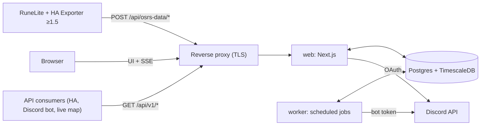

# Architecture

osrs-data-hub is a self-hostable web app for **one Discord guild**. It receives data from the
*HA Exporter* RuneLite plugin (v1.5+), aggregates it per OSRS account, shows it (dashboard, account and
guild pages, live toasts), and shares it (per-account, per-category permissions; a pull-only REST API
in Milestone 3).

This file is the living description of the system. The original design handoff is archived verbatim at
[`design/HANDOFF-draft2.md`](design/HANDOFF-draft2.md) and is referenced below as "handoff §N". Every
settled decision is recorded in the [decision log](#decision-log) with a stable ID (`D-12`); decisions
taken from the handoff say so, and decisions taken while building say why. Traps in the shared layer
live in [`gotchas/`](gotchas/README.md) and are cited by ID.

## Contents

1. [System context](#1-system-context)
2. [Repository layout](#2-repository-layout)
3. [Upstream protocol (HA Exporter v1.5)](#3-upstream-protocol-ha-exporter-v15)
4. [Identity, auth and membership](#4-identity-auth-and-membership)
5. [Devices and pairing](#5-devices-and-pairing)
6. [Ingest pipeline](#6-ingest-pipeline)
7. [Data model](#7-data-model)
8. [Retention and rollups](#8-retention-and-rollups)
9. [Permissions and privacy](#9-permissions-and-privacy)
10. [Live updates](#10-live-updates)
11. [Worker jobs](#11-worker-jobs)
12. [Configuration and operations](#12-configuration-and-operations)
13. [Milestones and status](#13-milestones-and-status)
14. [Decision log](#decision-log)

## 1. System context



| Service | Role |
|---|---|
| `web` | One Next.js app on the Node runtime: UI, auth, the plugin endpoints, the public API, the SSE stream. **One replica** (D-5). |
| `worker` | Long-running Node process running pg-boss scheduled jobs (§11). |
| `migrate` | One-shot container (the worker image) that applies DB migrations before `web` and `worker` start. |
| `db` | `timescale/timescaledb`, pinned to a Postgres major Timescale supports; Community features only. |
| `backup` | Optional nightly `pg_dump` with rotation (`ops/backup.sh`). |
| reverse proxy | Whatever the VM already runs. Must not buffer `text/event-stream`. |

There is no Redis. Rate limits and caches are in memory in the single `web` process; fan-out between
processes goes through Postgres `LISTEN/NOTIFY`.

## 2. Repository layout

```
apps/web            Next.js: UI, /api/osrs-data/* (plugin), /api/live/* (SSE), /api/v1/* (M3)
apps/worker         pg-boss jobs + the migrate entrypoint
packages/core       pure logic: payload schemas, version gate, time/staleness rules, event
                    normalization, derived-write planning, permission resolver, rate limiters, config
packages/db         Drizzle schema, migrations (incl. custom Timescale SQL), client, test DB helper
packages/server     DB-backed services shared by web and worker: ingest, pairing, devices, accounts,
                    sharing, Discord membership, live fan-out, offboarding
packages/fixtures   v1.5 plugin payloads (anonymized) used by tests
```

`packages/server` is an addition to the handoff layout (D-20): the handoff puts the ingest pipeline in
`packages/core`, but the pipeline needs the database, and keeping `core` free of I/O keeps every rule in
it unit-testable without Postgres.

## 3. Upstream protocol (HA Exporter v1.5)

The hub is a drop-in endpoint for the plugin's pairing and ingest protocol. The authoritative
description is handoff §3, verified against the plugin source at
`xXD4rkDragonXx/runelite-homeassistant-data-exporter@0ec2a36`; where the source and the handoff
disagree, the source wins and the difference is recorded here.

The protocol facts the hub relies on:

- `POST {base}/api/osrs-data/pair` with `{"code":"12345"}` and `X-Osrs-Exporter-Version`. A 2xx must
  carry a string `token`; an optional `name` becomes the connection name. Non-2xx may carry
  `{"error": "…"}`, which v1.5 shows to the player.
- `POST {base}/api/osrs-data/events` with `X-Osrs-Token` and the version header. The response body is
  ignored; only the status matters (handoff §3.2): 401 and 410 disable the connection, 429/503 pause it
  honouring `Retry-After` (events queue for up to 10 min, 50 payloads), other 4xx drop the payload,
  other 5xx back off exponentially.
- Payloads are Gson-serialized (nulls omitted). Every event has a UUID `eventId` and an epoch-ms
  `timestamp` from the player's PC clock. Resends reuse the same `eventId`.

## 4. Identity, auth and membership

- **Better Auth** with the Discord provider, the Drizzle adapter and database sessions (D-9). Scopes:
  `identify guilds.members.read`.
- **Sign-in gate:** `GET /users/@me/guilds/{GUILD_ID}/member` with the user's token. 404 → "not a member
  of <guild>"; if `DISCORD_REQUIRED_ROLE_IDS` is set the member needs at least one of them. Display
  name, avatar, nickname and roles are stored on the user.
- **Admin** = any role in `DISCORD_ADMIN_ROLE_IDS`, or listed in `ADMIN_DISCORD_USER_IDS`.
- **Re-verification** every 6 h (worker, bot token, `GET /guilds/{guild}/members/{user}`) and on every
  login. Only a *definitive* "unknown member" or a missing required role offboards; Discord errors and
  outages never do (fail open, alert after N consecutive failures).
- User states: `active` → `grace` → deleted (§11, handoff §14).

## 5. Devices and pairing

- **User** = a Discord identity. **Device** = one paired RuneLite connection = one token. **OSRS
  account** = a character identified by `accountHash`; accounts do not belong to users. One device can
  report many accounts and one account can be reported by several users' devices.
- **Pairing codes:** 5 digits, valid `PAIRING_CODE_TTL_SECONDS` (300), single-use, unique among active
  codes, at most 3 active per user.
- **Version gate:** `X-Osrs-Exporter-Version` is parsed numerically (`1.5`, `1.5.1`, `1.6-SNAPSHOT` →
  1.5.0 / 1.5.1 / 1.6.0) and compared with `MIN_PLUGIN_VERSION`. Missing or lower → 400 with an
  explanatory `error`, the code is **not** consumed, and the wizard is told (`outdated_plugin`) because
  older plugins don't show the error text.
- **Success:** `200 {"ok":true,"token":"<64 hex>","device_id":"<uuid>","name":"<HUB_NAME>"}`. Only
  `sha256(token)` is stored.
- **Rate limits on `/pair`:** 10 attempts per IP per 10 min, 60 per minute globally, temporary IP
  lockout after repeated failures. The code space is only 100k.
- **Decommissioned hub:** `/pair` answers 410 before anything else, as ingest does (D-56).

## 6. Ingest pipeline

`POST /api/osrs-data/events` is synchronous, one transaction per payload (handoff §7). Implemented in
`packages/server/src/ingest/`, with every decision rule in `packages/core`.

1. Decommission switch → 410. Authenticate `sha256(X-Osrs-Token)` → device → user; unknown/revoked
   device or inactive user → 401. The transaction checks again under row locks, so a revoke or an
   offboarding that commits while the payload is in flight also ends in 401 (D-55).
2. Version below minimum → `400 {"ok":false,"error":"plugin_outdated"}`; the device is flagged outdated.
3. Body over `INGEST_MAX_BODY_KB` → 413 (enforced while streaming, not from `Content-Length`).
4. Per-device token bucket (5/s, burst 30). Payloads carrying events always pass; snapshot-only payloads
   over the limit get `429` + `Retry-After: 3`, and so do unparsable bodies, which are then not archived
   (D-57).
5. The raw body is archived to `raw_payloads` outside the main transaction, and its final status is
   recorded afterwards.
6. Section-by-section lenient parsing: a malformed section or event is skipped and counted; the rest is
   processed.
7. Account resolution by `accountHash` (renames tracked in `account_names`), serialized per account with
   a transaction-scoped advisory lock.
8. Link user ↔ account (first reporter becomes owner; a blocked contributor's data is dropped with 200).
9. Presence always; special worlds update only live fields; staleness is judged **per device**.
10. Derived writes (XP samples, equipment changes, location samples, wealth, sessions), event insert with
    `ON CONFLICT DO NOTHING` on `(account_id, plugin_event_id, sub_index)`, `latest_state` upsert where a
    missing section keeps its previous value.
11. Commit; `pg_notify` inside the transaction is delivered on commit only. Deadlocks and racing
    unique inserts are retried in-process (D-49, TSDB-12); transactions that may create a hypertable
    chunk take one shared advisory lock first, so chunk creation never deadlocks (D-58).
12. 200 on success including all-duplicate payloads; 503 + `Retry-After: 30` on transient DB failures.

## 7. Data model

See handoff §8 for the logical model; the Drizzle schema in `packages/db/src/schema/` is the physical
one. Hypertables: `xp_samples`, `location_samples`, `raw_payloads`. Continuous aggregates: `xp_hourly`,
`xp_daily` (hierarchical).

## 8. Retention and rollups

| Data | Granularity | Kept for | Mechanism |
|---|---|---|---|
| `latest_state` | 1 row per account | while the account exists | upsert |
| `xp_samples` | 5 min, change-only, last value | `XP_RAW_RETENTION_DAYS` (365) | retention policy; compressed after 7 days |
| `xp_hourly` | 1 h, last value | forever | continuous aggregate |
| `xp_daily` | 1 day, last value | forever | hierarchical continuous aggregate |
| `events` | each event | forever | plain table |
| `play_sessions`, `equipment_changes`, `wealth_daily` | per change / per day | forever | plain |
| `location_samples` | ≤ 1 per minute | `LOCATION_RETENTION_DAYS` (30) | retention policy |
| `raw_payloads` | each payload | `RAW_PAYLOAD_RETENTION_HOURS` (72) | compressed after 6 h, retention |
| `audit_log` | each entry | `AUDIT_LOG_RETENTION_DAYS` (730) | worker |

XP only goes up, so every rollup takes the **last value per bucket, never an average**:
`xp_at(t)` = last sample at or before `t`, `gains(a, b) = xp_at(b) − xp_at(a)`.

## 9. Permissions and privacy

The plugin is the first privacy layer (players choose what is sent); the hub stores only what arrives,
never synthesizes events from snapshots, and shows unsent sections as "not shared". Sharing inside the
hub is the second layer:

| Category | Covers | Default |
|---|---|---|
| `stats` | skills, XP history, gains, levels | guild |
| `events` | loot, level-ups, deaths, collection log, diaries, combat tasks, superiors | guild |
| `activity` | online status, world, sessions and playtime, HP, prayer, spellbook | guild |
| `location_live` | current coordinates | private |
| `location_history` | the 30-day trail | private |
| `equipment` | current gear and its change log | private |
| `inventory` | current inventory and wealth history | private |

Viewing rule: owner or (non-blocked) contributor, OR audience `guild` and the viewer is active, OR
audience `selected` and a grant exists. Accounts whose owner is in `grace` without a transfer are hidden
from everyone except admins. `death.location` and `superiorSpawn.location` are redacted unless the viewer
can see `location_live` or `location_history`. One resolver in `packages/core` serves the UI, the SSE
filter and the API.

## 10. Live updates

`GET /api/live/stream` (session auth, SSE). The web process holds one `LISTEN` connection
(`hub_events`, `hub_state`, `hub_pairing`) and fans out to every open stream after the permission check
and the viewer's toast filter. Heartbeat comment every 25 s, `retry:` hint, `X-Accel-Buffering: no`,
`Last-Event-ID` replays the last 5 minutes; `/api/live/events?after=<seq>` is the polling fallback.
Toasts are skipped for events older than 15 minutes (they still reach the feed).

## 11. Worker jobs

| Job | Schedule |
|---|---|
| Close stale presence and sessions | every minute |
| Discord re-verification | every 6 h, staggered |
| Offboarding grace expiry, then the orphaned-account purge (D-61) | hourly |
| Re-apply Timescale policies from env | at startup |
| Clean up raw payloads | periodic (retention policy does the work) |
| Prune the audit log | daily |

## 12. Configuration and operations

All configuration is environment variables; see [`.env.example`](../.env.example) for the full list with
defaults, and [`OPERATIONS.md`](OPERATIONS.md) for deploys, backups and the reverse proxy.

## 13. Milestones and status

| Milestone | Scope | Status |
|---|---|---|
| M0 Scaffold | monorepo, compose, DB + Timescale migrations, CI, fixtures | in progress |
| M1 Ingest + onboarding | login + guild gate, pairing, ingest, wizard, devices, dashboard, toasts, default sharing | in progress |
| M2 History & sharing | charts, aggregates/retention, sessions, equipment, wealth, locations, sharing UI, guild page, re-verification/offboarding, admin basics | planned |
| M3 Public API | API keys, `/api/v1/*`, OpenAPI, cursor feed, `/snapshot` | planned |
| M4 Hardening | metrics dashboards, verified restores, export/delete, leaderboards, decommission switch | planned |

## Decision log

Decisions are permanent IDs; a reversed decision is marked superseded, never deleted or renumbered.
"Handoff" means the decision was settled in the design handoff before building started.

| ID | Decision | Why | Source |
|---|---|---|---|
| D-1 | Plugin **v1.5 is the minimum**; older versions are refused at pairing and ingest. | The hub relies on v1.5 guarantees: event ids, timestamps, stable account identity, backoff, nothing sent from special worlds by default. | Handoff §2, §6.2 |
| D-2 | One guild per deployment; another clan self-hosts by changing env vars. | Keeps auth and sharing simple. | Handoff §2 |
| D-3 | The public API is **pull-only**; no webhooks. SSE is internal to the hub's own UI. | Consumers poll `/snapshot` and the `/events` cursor feed. | Handoff §2, §13 |
| D-4 | Privacy follows the plugin: store only what arrives, never synthesize events or toasts from snapshots, show unsent sections as "not shared". | The player's plugin settings are the first privacy layer. | Handoff §2, §10 |
| D-5 | Docker Compose on one VM, **one `web` replica**, no Redis; rate limits and caches in memory; cross-process fan-out via `LISTEN/NOTIFY`. | Enough for one guild; adding replicas later only needs a shared rate limiter. | Handoff §4.1 |
| D-6 | TypeScript + pnpm workspaces; Next.js (App Router, route handlers on the Node runtime, never edge). | One language across web, worker and shared logic. | Handoff §4.2 |
| D-7 | Postgres + TimescaleDB Community (hypertables, compression, retention, continuous aggregates). | 10+ years of history with bounded storage. | Handoff §4.1, §9 |
| D-8 | Drizzle ORM + drizzle-kit; Timescale objects in **custom SQL migrations**. | Drizzle doesn't model hypertables or continuous aggregates. | Handoff §4.2 |
| D-9 | Better Auth with the Discord provider, Drizzle adapter, **database sessions**. | Auth.js is now part of Better Auth; DB sessions allow instant revocation. | Handoff §4.2 |
| D-10 | zod for validation: lenient section-by-section for plugin payloads, strict for our own API. | Unknown plugin fields pass through; one bad section never loses the rest. | Handoff §4.2, §7.1 |
| D-11 | pg-boss for scheduled jobs. | Postgres-backed; no extra infrastructure. | Handoff §4.2 |
| D-12 | Tailwind + shadcn/ui, sonner for toasts, a time-series-friendly chart library. | XP charts have many points. | Handoff §4.2 |
| D-13 | Vitest (unit + fixture-driven ingest tests) and Playwright (wizard e2e). | | Handoff §4.2 |
| D-14 | pino logs, `/api/health`, Prometheus `/metrics` (token-protected). | Fits the existing Grafana/Prometheus setup. | Handoff §4.2 |
| D-15 | Everything is keyed by the internal account id, resolved from `accountHash`; display names are history (`account_names`). | Name-keyed history merges accounts that swap names (ha-osrs-data lesson 3). | Handoff §3.6, §7.2 |
| D-16 | **No payload-level dedupe.** One mechanism: unique `(account_id, plugin_event_id, sub_index)`, kept forever; nothing is marked seen before commit. | Resends are legitimate; marking-before-processing lost data in ha-osrs-data (lesson 2). | Handoff §3.6, §7.4 |
| D-17 | Timestamps: `payload_ts = min(root.timestamp, recv)`; staleness only against the **same device's** last applied snapshot; `occurred_at = clamp(event.timestamp, recv − 15 min, recv)`; presence always refreshed. | Player clocks are wrong and differ between PCs (ha-osrs-data lesson 1). | Handoff §7.3 |
| D-18 | A missing section keeps its last value with its own `*_updated_at`; only `location` expires (2 min for live views). | Filtered sections must not be overwritten with empty values (ha-osrs-data lesson 4). | Handoff §3.6, §7.1 |
| D-19 | Status codes: 401 only for auth, 410 only for decommissioning, 429/503 + `Retry-After` for backpressure, 400 for bad input, 5xx only for transient faults. | Matches the plugin's `ConnectionBackoff` semantics; events queue for 10 min on 429/503. | Handoff §3.2, §7.7 |
| D-20 | Add `packages/server` for DB-backed services; `packages/core` stays free of I/O. | The handoff lists the ingest pipeline under `core`, but it needs the database; separating rules from I/O keeps every rule unit-testable. | Build |
| D-21 | Accounts don't belong to users: owner + contributors via `account_links`; first reporter becomes owner. | Shared accounts are expected. | Handoff §6.1 |
| D-22 | Seven sharing categories with defaults (stats/events/activity → guild; location, equipment, inventory → private); one resolver used by UI, SSE and API. | | Handoff §10 |
| D-23 | XP rollups use the last value per bucket; `xp_samples` is change-only at 5-minute buckets keyed on receive time, `xp = GREATEST(existing, new)`. | XP is monotonic; receive time avoids cross-PC clock skew. | Handoff §7.1, §9 |
| D-24 | An XP drop on a normal world skips the payload's XP writes. | Catches world types the hub doesn't know about. | Handoff §7.1 |
| D-25 | Offboarding: `active` → `grace` (30 days) → hard delete; devices, API keys and sessions revoked immediately; ownership transferred to the longest-linked active contributor, else the account is hidden. Discord errors never offboard. | | Handoff §5, §14 |
| D-26 | **`APP_URL` must be an origin** (no path prefix); startup fails otherwise. Supersedes the handoff's "may include a path prefix". | Next.js `basePath` is baked in at build time, so a prefix can't be configured by env alone (NEXT-1). A prefix would need a per-deployment image build; revisit if someone needs it. | Build |
| D-27 | Postgres **18** + TimescaleDB 2.30.1 (`timescale/timescaledb:2.30.1-pg18`), ids default to native `uuidv7()`. `drizzle-kit push`/`pull` are banned; migrations are `generate` + `migrate` only. | Longest support runway; pg18's `uuidv7()`; push drops Timescale indexes and churns PKs on pg18 (DB-6). | Build |
| D-28 | Presence: in-game = `LOGGED_IN`, `LOADING`, `HOPPING`, `CONNECTION_LOST`; timeout `floor(tickDelay × 3.1 × 0.6)` s with a **60 s floor** (25 min when unknown). | The plugin sends from LOADING/HOPPING (PLUGIN-1); a tiny sendRate must not make presence flap. | Build (plugin source) |
| D-29 | Payloads with no usable identity (no `player`, or a partial `player` without name and hash) are answered **200 and ignored** (a `clientShutdown` in them still closes the device's sessions). Supersedes handoff §7.1.5's 400 for that case. | The plugin sends them on every client start and login (PLUGIN-1); 400 would flood the metrics with expected traffic. | Build (plugin source) |
| D-30 | **Payload-caused errors are 400, never 5xx**; only transient faults return 503 + `Retry-After: 30`; an unexpected bug returns 500. | A deterministic 5xx blocks the plugin's queue head and loses ~5.5 min of events (PLUGIN-3). | Build (plugin source) |
| D-31 | `raw_payloads.body` is `text`; `events.data` is the event from the raw JSON (not the zod output) with NUL characters stripped. | jsonb rejects invalid JSON and `\u0000` (DB-1); zod 4 strips unknown keys (ZOD-1). | Build |
| D-32 | `pg_notify` is called **inside** the ingest/pairing transaction. | Delivered on commit only, never on rollback; nothing can be announced that wasn't stored. | Build (verified live) |
| D-33 | A stale snapshot refreshes presence (`last_seen`, `last_device_id`) but does not regress `game_state`. | Staleness means "older than what we have"; its game state is older information too. | Build |
| D-34 | Discord: **fail closed at sign-in** (no verdict → no session), **fail open for re-verification**; only 404 + code **10007** offboards, with a circuit breaker (> 20 % not-member in a batch → offboard nobody, alert). | A bot that isn't in the guild also gets 404 (code 10004), which would offboard everyone (DISCORD-1). | Build |
| D-35 | `users.offboard_reason` (`left_guild`, `lost_role`, `admin`, `self_delete`). Logging in again restores membership-reason offboardings; **admin offboarding is not undone by logging in**. | The handoff's "coming back within the grace period" is about membership; an admin decision must stick. | Build |
| D-36 | App mutations (pairing codes, devices, settings, sharing) use **route handlers with an Origin check**, not Server Actions. | Server Actions fail with 500 when the reverse proxy rewrites `Host` (NEXT-5); route handlers are also easy to test. | Build |
| D-37 | Every process-wide singleton (DB pool, auth, logger, metrics, rate limiters, the LISTEN client and SSE hub) lives on `globalThis`. | Next runs route handlers and RSC in separate module instances (NEXT-3). | Build |
| D-38 | `GET` on the plugin endpoints answers `400 {"error": …}` explaining that the URL must be exactly the `https://` one from the wizard; the endpoints never redirect. | A redirect turns the plugin's POST into a body-less GET or is not followed at all; data is lost silently (PLUGIN-2). | Build (plugin source) |
| D-39 | Better Auth: only the user table is renamed (`users`); Discord tokens are stripped from `account`; token/profile-editing endpoints are disabled; users get a placeholder email `<discordId>@discord.invalid`. | Minimal token exposure; the hub doesn't request the email scope (AUTH-3, AUTH-4). | Build |
| D-40 | Migrations create **structure only**; the worker reconciles compression, retention and aggregate-refresh policies from env at startup. Raw-payload clean-up is the retention policy (no job); backups are the `backup` service, not a worker job. | `if_not_exists` doesn't update policies (TSDB-3); test databases stay free of background jobs; the worker image has no `pg_dump`. | Build |
| D-41 | Toolchain: TypeScript **6.0.3 pinned**, ESLint 10 flat config at the root, Vitest projects, Node 24 in images. | TS 7 has no JS API for typescript-eslint/Next (TOOL-1). | Build |
| D-42 | Client IP = the `X-Forwarded-For` entry `TRUST_PROXY_HOPS` from the right; the same IP is handed to Better Auth through an internal header. | Next 16 has no `request.ip`; one setting for both limiters. | Build |
| D-43 | Discord re-verification runs every 15 minutes over a batch of users whose last check is older than 6 h. | Staggers the bot's lookups instead of a burst every 6 h. | Build |
| D-44 | The derived `Overall` skill's level is the **real** total level, `Σ min(level, 99)`. | Plugin levels are virtual above 99 (PLUGIN-9). | Build |
| D-45 | Special-world payloads still track play sessions (only XP, gains, wealth, equipment and location are skipped). | Playtime is playtime; the world list shows where it happened. | Build |
| D-46 | Account public ids are random 12-character base62 strings; events use their uuid v7 `id`. | "IDs are opaque public ids, never database serials" (handoff §13). | Build |
| D-47 | Renames and account-type changes are taken only from snapshots that are actually applied (not stale, special-world or XP-guarded). | Those snapshots may be older data or another character under the same hash. | Build |
| D-48 | A blocked contributor's payload is rolled back entirely (not even `last_seen` or a rename) and answered 200. | "Store nothing" (handoff §7.1.7); 200 so the plugin doesn't retry. | Build |
| D-49 | Ingest retries its transaction in-process on deadlock, serialization failure or a racing unique insert, and resolves unknown skill names in a committed step before it. | Creating a hypertable chunk locks the referenced `osrs_accounts` table, so concurrent payloads can deadlock (TSDB-12); a retry costs about 1 s, well inside the plugin's 10 s timeout. | Build |
| D-50 | An account's "last seen" is presence data: shown only to viewers with the `activity` category. | Returning it otherwise leaks what the owner made private. | Build |
| D-51 | XP-at-time lookups read `xp_samples` first and fall back to `xp_hourly` only where no raw sample exists. | Same results at bucket edges, far cheaper than a top-1 over a real-time aggregate (TSDB-13), and more accurate for late writes (TSDB-7). | Build |
| D-52 | Transferring or claiming a hidden account also un-hides it; removing a *blocked* contributor is refused. | The reason it was hidden no longer holds; deleting the link would silently delete the block. | Build |
| D-53 | Prometheus label cardinality is bounded (32 plugin-version labels, then `other`; known event types or `other`). | Label values come from clients. | Build |
| D-54 | *(first clause superseded by D-59)* `/pair` limits: the global limit counts every attempt; IPv6 clients are keyed by their /64; a successful pairing does not clear the failure count. | One client rotates addresses inside its /64; interleaving your own valid codes must not reset a lockout. | Build |
| D-55 | The ingest transaction first locks the reporting user's row `FOR SHARE` and re-checks `status = 'active'`, and re-checks `devices.revoked_at` under the device row lock; either failing → 401. | `authenticateDevice` runs before the transaction. Offboarding locks the same user row first, so the two serialize: a new account's first payload in flight can no longer make a user in grace its owner and leave it visible, and a revoke committed mid-request stores nothing. User row before the account lock, as offboarding orders them. Pairing locks the code's creator the same way. | Build |
| D-56 | `/pair` honours the decommission switch: 410 before rate limits, body or version checks. | A decommissioned hub must not hand out tokens whose first payload gets 410 (D-19). | Build |
| D-57 | The `pluginVersions` metric counts authenticated requests only; unparsable bodies take a rate-limit token and past the bucket get 429 without being archived. | Strangers could otherwise use up the 32 version labels (D-53), and a device could fill `raw_payloads` with 256 KB invalid bodies. | Build |
| D-58 | An ingest transaction whose XP or location write may create a new hypertable chunk first takes one shared advisory lock (`0x4f43`, 0); the chunk ranges already written and committed are remembered in-process, so the lock is taken only for the first payloads of a new day or week and after a restart. | Chunk creation holds `ShareRowExclusiveLock` on `osrs_accounts` until commit; two transactions creating `xp_samples` and `location_samples` chunks in different orders deadlocked at every boundary with a few concurrent payloads (TSDB-12). | Build |
| D-59 | Supersedes D-54's first clause: `/pair` checks the lockout, then the per-client limit **without counting**, then the global limit, then counts the per-client hit; an attempt any limit refuses counts towards none of them. The code's creator is locked `FOR SHARE` before the code is consumed. | Counting refused attempts let one client fill the global limit and block pairing for everyone; the user lock keeps pairing and offboarding from interleaving. | Build |
| D-60 | Hidden accounts come back: when a user is restored (or an active, non-blocked contributor reports the account), an account that is hidden because its owner is in grace is transferred to that contributor and un-hidden, with an audit entry. | Applies handoff §14.3 ("transfer to an active contributor, else hide") lazily, at the moment a contributor becomes available again. | Build (confirmed by the owner, 2026-09-29) |
| D-61 | **Orphaned accounts are purged on a time gate.** The hourly grace job hard-deletes (all data, including continuous-aggregate rows, TSDB-2) every account with **no owner and no non-blocked link to any user**, once it has been hidden, or if never hidden unseen, for `OFFBOARD_GRACE_DAYS`: `coalesce(hidden_at, last_seen) < now − OFFBOARD_GRACE_DAYS`. Each account is re-checked under ingest's account lock first. Accounts whose owner is in grace are settled by that owner's grace expiry (transfer to a successor, or delete); accounts with an existing owner are never purged. | Handoff §14.5 deletes account data only when a user's grace expires. What slips through (a bare row from a refused first payload, an account left with only blocked contributors) could never be matched again and would keep its data forever. Together with §14.5 every account either has an owner who can reach it or is deleted within a bounded time. | Build (requested by the owner, 2026-09-29) |
