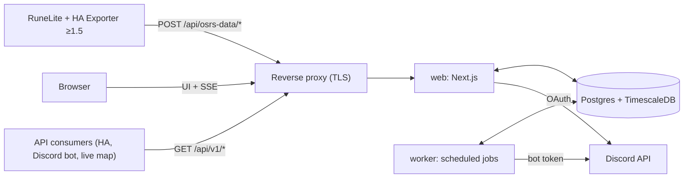
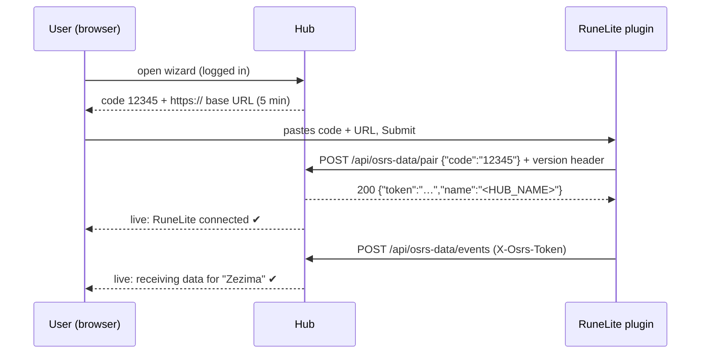

# osrs-data-hub — Architecture & Design Handoff

> **Version:** draft 2 · 2026-09-28 · **Owner:** Red
> **Audience:** the coding session that builds this. Read the whole document before scaffolding. The numbered sections are settled decisions. §18 lists points that are still open.
> **Protocol baseline: HA Exporter plugin v1.5.** Everything in §3 was checked against the plugin at `xXD4rkDragonXx/runelite-homeassistant-data-exporter@0ec2a36` (v1.5, 303 tests passing) and against `RedFirebreak/ha-osrs-data@e4a3426`. When the code and this document disagree, the plugin's source code wins. Versions older than 1.5 are **not supported** (§6.2).

---

## 1. What we're building

**osrs-data-hub** is a self-hostable web app for one Discord guild (clan). It does four things:

1. **Receives** data from the *HA Exporter* RuneLite plugin. It's a drop-in endpoint that speaks the plugin's pairing and ingest protocol, the same one the ha-osrs-data Home Assistant integration implements.
2. **Aggregates** that data per OSRS account: current state, long-term XP history, events (loot, levels, deaths, …), play sessions, gear, wealth, and a location trail.
3. **Shows** it: a personal dashboard, a guild view, and live event toasts.
4. **Shares** it: per-account and per-category permissions, plus a **pull-only REST API** with scoped API keys for other apps (Home Assistant, a Discord bot, a live map).

To get in, a user logs in with Discord, must be a member of the configured guild, and optionally needs one of the configured roles.

## 2. Goals, non-goals, MVP

**Goals**
- A non-technical player is onboarded in under 2 minutes: log in → wizard → "we're receiving data for *Zezima*".
- 10+ years of history with bounded storage (§9).
- Plugin **v1.5 is the baseline**. The hub leans on its guarantees: event ids, timestamps, stable account identity, backoff, and nothing sent from special worlds by default.
- Another clan can self-host it by changing env vars only (one guild per deployment).
- **Privacy follows the plugin.** Players choose in the plugin which data and which events they send. Missing data means "not shared", and the hub never reconstructs it (§10).

**Non-goals**
- Pushing data to consumers (webhooks and similar). The API is pull-only. SSE for the hub's own UI is internal.
- Several guilds in one instance.
- "Teammates" or Discord-role-based groups (abandoned).
- Bank tracking (the plugin doesn't send the bank).
- An interactive world map inside the hub. The live map is a separate consumer app, and the hub only provides the data for it.
- Supporting plugin versions older than 1.5.

**MVP** is Milestones 1 and 2 (§17): login and guild gate, the pairing wizard, ingest, a dashboard with XP, gains and events, device management, default sharing, and **live event toasts**. The public API is Milestone 3.

---

## 3. Upstream protocol: HA Exporter v1.5 (verified from source)

### 3.1 Endpoints the plugin calls
The user types a base URL into the plugin panel's "Endpoint URL" field. The plugin strips trailing `/` and appends fixed paths, so a base URL with a path prefix works.

| Call | Request | What the plugin does with the response |
|---|---|---|
| **Pair** | `POST {base}/api/osrs-data/pair`<br>headers: `X-Osrs-Exporter-Version: 1.5`<br>body: `{"code":"12345"}` (no token yet) | **2xx** with JSON: requires a string `token`. An optional string `name` becomes the connection's display name (`<`, `>` and control characters are stripped; max 64 characters).<br>**non-2xx**: an optional JSON `{"error":"…"}` is shown in the failure dialog (sanitized, max 200 characters, body read up to 8 KB). |
| **Ingest** | `POST {base}/api/osrs-data/events`<br>headers: `X-Osrs-Token: <token>`, `X-Osrs-Exporter-Version: 1.5`<br>content type on the wire: `application/json; charset=utf-8` (don't match it exactly)<br>body: payload (§3.3) | See §3.2. The response body is ignored. |

- The pairing code is exactly **5 digits**. The panel only accepts digits and supports pasting.
- **A URL without a scheme fails silently.** The plugin shows no dialog, and this is being left as-is upstream. The wizard must show the full `https://…` URL with a copy button (§6.3).
- One RuneLite install can hold many connections, e.g. HA and the hub side by side. **Global** and **per-connection** toggles strip `inventory`, `equipment`, `location` and whole event types before sending. `clientShutdown` and unknown event types are never stripped.

### 3.2 Status codes, backoff, retry queue (`ConnectionBackoff`)
| Response | Plugin behaviour |
|---|---|
| 2xx | Success. Resets the backoff and sends anything queued. |
| **401** | Disables the connection: "Unauthorized (401): Token may have been revoked." The user has to re-pair (or re-enable it, which just 401s again). |
| **410** | Disables the connection: "Endpoint gone (410): this endpoint no longer accepts data." |
| **429 / 503** | Pauses the connection until `Retry-After` (delta-seconds or an HTTP date), clamped to 1 s – 10 min. Without a valid `Retry-After` it uses exponential backoff instead. |
| Other 5xx, network error, timeout | Exponential backoff: 30 s doubling up to 10 min, reset on the next success. |
| Other 4xx (400, 403, 404, 413, …) | The payload is dropped. No retry, no pause. |

While a connection is paused:
- Snapshot-only payloads are **dropped**. The next snapshot carries the full state anyway.
- Payloads that carry **events are queued**: at most 50 per connection, at most 10 minutes old, oldest dropped first. They're resent **in order** once the pause ends, and new event payloads line up behind the queue.
- The queue is cleared when the connection is disabled or the plugin is turned off.

**What this means for the hub**
- **Duplicates happen.** A payload can be resent even after the hub committed it, for example when the response timed out. Dedupe on `eventId` (§7.4).
- **Resent payloads are old.** They keep their original root `timestamp`, so their snapshot may be stale (§7.3).
- **401** is only for auth failures. **410** is only for "never send here again" (reserved for decommissioning an instance). **429/503 + `Retry-After`** are safe backpressure tools, because events wait in the queue for up to 10 minutes. **400** is for bad input, which is never retried. Return **5xx only for transient server faults**, where a retry is wanted; it's safe because ingest is transactional and keyed on `eventId`.

### 3.3 Payload (v1.5)
The payload is serialized with RuneLite's Gson, which doesn't serialize nulls, so most fields can be missing.
- `events`, `tickDelay` and `timestamp` are always present. `tickDelay: 0` means unknown.
- `player` is missing only in one case: the plugin is disabled while on the login screen. That payload looks like `{"events":[{"type":"clientShutdown","data":"Disabled",…}],"tickDelay":0,"timestamp":…}`.

```jsonc
{
  "player": {
    "name": "Zezima",
    "accountHash": "de731bc0f710567a…",  // salted SHA-224, 56 lowercase hex chars. Stable across name changes.
                                         // Omitted only when not logged in. Can't be reversed or matched against other plugins.
    "accountType": "0",                  // string of the IRONMAN varbit: 0 normal, 1 IM, 2 UIM, 3 HCIM, 4 GIM, 5 HCGIM, 6 UGIM
    "world": "302",                      // string
    "worldTypes": ["MEMBERS"],           // RuneLite WorldType names in enum order; [] on F2P worlds
    "location": { "x": 3222, "y": 3218, "plane": 0, "isOnBoat": false },
    "health": { "current": 85, "max": 99 },
    "prayerPoints": { "current": 52, "max": 70 },
    "spellbook": { "id": 0, "name": "standard" },       // standard | ancient | lunar | arceuus | unknown
    "stats": { "skills": { "Attack": { "xp": 13034431, "level": 99 } /* …every skill */ } },
    "inventory": { "items": [ { "name": "Shark", "id": 385, "gePrice": 800, "haPrice": 150, "quantity": 5 } ] },
    "equipment": { "items": [ { "name": "Abyssal whip", "id": 4151, "gePrice": 1500000, "haPrice": 72000, "quantity": 1, "equipmentSlot": "WEAPON" } ] }
  },
  "events": [
    { "type": "loot", "data": { /* §3.4 */ }, "eventId": "3f2c9a4e-8d1b-4c6e-9f0a-2b7d5e1c8a90", "timestamp": 1790000000000 }
  ],
  "state": "LOGGED_IN",                  // RuneLite GameState name
  "tickDelay": 100,                      // configured send rate in ticks (1 tick = 0.6 s)
  "timestamp": 1790000000123             // epoch ms when the payload was built, by the player's PC clock
}
```

- **Timestamps come from the player's PC clock** and can be wrong or skewed between PCs. Never trust them beyond the clamping rules in §7.3.
- `skills` is keyed by skill **display names** (`Skill.getName()`: "Attack", "Runecraft", …) and includes every skill the client knows, Sailing included. Don't hardcode the list or the count; keep a `skills` table that grows. "Combat" only appears in `levelUp` events.
- Levels of 99 and above are **virtual levels** computed from XP (up to 127 at 200M).
- `gePrice` is a **per-unit long**. `haPrice` is a per-unit int. Compute stack values as 64-bit on the server.
- `equipmentSlot` values are RuneLite `EquipmentInventorySlot` names: HEAD, CAPE, AMULET, WEAPON, BODY, SHIELD, LEGS, GLOVES, BOOTS, RING, AMMO.

### 3.4 Event types and the player's filters
Every event looks like `{type, data, eventId (UUID), timestamp (epoch ms)}`. Each event is sent **exactly once**, except for retries of the same payload, which reuse the same `eventId`.

| type | data | Immediate send? | Player-side filters (privacy) |
|---|---|---|---|
| `loot` / `pkLoot` | `{items[], highestValueItem, totalValue (long), source:{text, link?}, type (LootRecordType), npcId?, criteria[]}`. Items may carry `rarity`. | yes | min value per item stack (default 25k), rarity threshold, item allow/deny lists, source denylist (default "Einar"), toggles for PvP loot, PK chests and pickpocketing |
| `death` | `{valueLost (long), danger: SAFE\|DANGEROUS\|EXCEPTIONAL, killerName?, killerNpcId?, keptItems[], lostItems[], location:{x,y,plane}}` | yes | on/off |
| `levelUp` | an **array** of `{skill, level}`; `skill` can be `"Combat"` | yes | min level, interval (every N levels), virtual levels on/off, combat level on/off |
| `collectionLog` | `{itemName, itemId, value (long), killCount?}` | yes | min value |
| `superiorSpawn` | `{name, npcId, location}` | yes | on/off |
| `achievementDiary` | `{region, tier}`. Fires **per task**, so identical repeats are legitimate. | no (goes with the next periodic send) | min tier |
| `combatTask` | `{taskName, tier}` | no (goes with the next periodic send) | min tier |
| `clientShutdown` | a string: `"Logout"`, `"Shutdown"` or `"Disabled"` | yes | never filtered |

Every type can also be turned off globally or per connection. Store unknown types as-is (forward compatibility); don't reject them.

**Quirks that remain** (accepted upstream; the hub deals with them):
- `loot`
  - `criteria` is always `[]`.
  - `pkLoot` is only used for "Loot Chest" (PK keys). PvP kills arrive as `loot` with `type: "PLAYER"`.
- `death`
  - Kept and lost items come from the **inventory only**; worn equipment isn't counted.
  - SAFE and EXCEPTIONAL deaths always have `lostItems: []` and `valueLost: 0`.
  - Label this in the UI as "inventory value lost".
- `collectionLog`: `itemId` is `-1` and `value` is `0` when the plugin can't resolve the item name.
- `combatTask`: `taskName` isn't trimmed and still has the points suffix, e.g. `" No Pressure (6 points)."`. Normalize it for display: trim it, and parse `points` into its own field.

### 3.5 When the plugin sends
- A full snapshot goes out every `sendRate` ticks (default 100, about 60 s) while logged in. Any immediate send resets that timer.
- An immediate full snapshot also goes out on:
  - login and every world hop;
  - loot, death, level-up, collection log and superior spawn;
  - logout and plugin disable;
  - **every `StatChanged` for Hitpoints or Prayer**. That includes HP XP on every combat hit and prayer drain. Both are on by default, so combat produces bursts.
- Sends are asynchronous. Two payloads from the same tick **can arrive out of order**.
- **Special worlds** (SEASONAL, DEADMAN, TOURNAMENT_WORLD, BETA_WORLD, QUEST_SPEEDRUNNING, NOSAVE_MODE, PVP_ARENA): by default the plugin sends **nothing at all** there, not even a logout. A player can opt in with "Special world data", and then `worldTypes` identifies those payloads.
- Level tracking restarts on world hop and logout, so switching accounts no longer produces fake level-ups.

### 3.6 Lessons from reviewing ha-osrs-data (don't repeat these)
The HA integration implements the same protocol. Reviewing it turned up bugs the hub must avoid (a fix prompt for HA exists separately):

1. **Stale checks against a clock that runs ahead.** A future timestamp froze all later snapshots and marked the account offline. → Clamp timestamps to the receive time, compare staleness **per device**, and always refresh `last_seen` (§7.3).
2. **Recording a payload as "seen" before processing it**, then returning 500 for bad input. The plugin's retry was answered "duplicate" and the data was lost. → No payload-level dedupe. Dedupe per event inside the transaction, and send bad input to 400 (§7.1).
3. **History keyed by display name.** Accounts that swap names merge. → Key everything by the internal account id.
4. **Filtered-out sections overwritten with empty values** (an inventory of `[]`, a location of `0,0,0`). → A missing section keeps its last value plus its own `updated_at`. Only `location` expires (§7.1).
5. **An unauthenticated `/pair` with no rate limit.** → Rate-limit it (§6.2).

---

## 4. Architecture

### 4.1 Deployment (Docker Compose on a VM)


| Service | Role |
|---|---|
| `web` | One Next.js app on the Node runtime: UI, auth, the plugin endpoints, the public API, and the SSE stream. |
| `worker` | Same monorepo, a long-running Node process for scheduled jobs (§4.3). |
| `db` | The `timescale/timescaledb` image, pinned to a Postgres major that Timescale supports. Uses the Community edition features (hypertables, compression, retention and continuous aggregates), which are free to self-host. |
| reverse proxy | Whatever the VM already runs (Caddy, Traefik or nginx). It **must not buffer** `text/event-stream`. |
| `backup` (optional) | Nightly `pg_dump` (§16). |

There's **no Redis in the MVP.** The design assumes **one `web` replica**, with rate limits and caches in memory. Fan-out between processes goes through Postgres `LISTEN/NOTIFY`, so adding replicas later only needs a shared rate limiter.

### 4.2 Stack
| Concern | Choice | Why |
|---|---|---|
| Language / repo | TypeScript, pnpm workspaces | One language across web, worker and shared logic |
| Web | Next.js (current stable, App Router, route handlers on the **Node** runtime, never edge) | Red's primary stack |
| DB access | Drizzle ORM + drizzle-kit, with Timescale objects created in **custom SQL migrations** | Drizzle doesn't model hypertables or continuous aggregates |
| Auth | Better Auth with the Discord provider, the Drizzle adapter and **database sessions** | Auth.js is now part of Better Auth, which is recommended for new projects. Database sessions allow instant revocation. |
| Validation | zod: section-by-section and lenient for plugin payloads, strict for our own API | |
| Jobs | pg-boss (cron and queues backed by Postgres) | No extra infrastructure |
| UI | Tailwind + shadcn/ui, sonner for toasts, a chart library that handles time series well (ECharts or uPlot) | XP charts have lots of points |
| API docs | OpenAPI 3.1 generated from the zod schemas, served with an interactive reference page | |
| Tests | Vitest (unit tests, plus ingest tests against captured payload fixtures) and Playwright (wizard end-to-end) | |
| Observability | pino logs, `/api/health`, Prometheus `/metrics` (internal only) | Fits the existing Grafana/Prometheus setup |

### 4.3 Repo layout
```
apps/web          Next.js: UI, /api/osrs-data/* (plugin), /api/v1/* (public API), /api/live/* (SSE)
apps/worker       pg-boss jobs
packages/db       Drizzle schema, migrations (incl. custom Timescale SQL), typed query helpers
packages/core     payload schemas, ingest pipeline, account resolution, permission resolver,
                  event normalization. Pure logic with unit tests, used by both web and worker.
packages/fixtures real v1.5 plugin payloads (anonymized) for tests
```

Worker jobs:

| Job | Schedule |
|---|---|
| Close stale presence and sessions | every minute |
| Discord re-verification | every 6 h, staggered |
| Offboarding grace expiry | hourly |
| Re-apply Timescale policies from env | at startup |
| Clean up raw payloads | periodic |
| Prune the audit log | periodic |
| Backup | nightly |

---

## 5. Identity, auth, membership

- **Discord OAuth2 scopes:** `identify guilds.members.read`.
- **On sign-in:** call `GET /users/@me/guilds/{GUILD_ID}/member` with the user's token.
  - A 404 means rejection: "not a member of \<guild\>".
  - If `DISCORD_REQUIRED_ROLE_IDS` is set, the user needs at least one of those roles.
  - Store the display name, avatar, nickname and roles.
- **Admin** means having any role in `DISCORD_ADMIN_ROLE_IDS`, or being listed in `ADMIN_DISCORD_USER_IDS` (bootstrap).
- **Re-verification:** the worker calls `GET /guilds/{guild.id}/members/{user.id}` with the bot token every 6 h, and on every login.
  - This single-member lookup needs **no privileged intent**. The bot only has to be in the guild, with no permissions.
  - A definitive 404, or a missing required role, triggers offboarding (§14).
  - Discord errors or outages **never** offboard anyone. Fail open, and alert after N failures in a row.
  - Honour Discord's 429 `retry_after`.
- **User states:** `active` → `grace` (offboarded, waiting for deletion) → deleted. Coming back within the grace period returns the user to `active`.

---

## 6. Devices, pairing, onboarding

### 6.1 Concepts
- **User**: a Discord identity.
- **Device**: one paired RuneLite connection, i.e. one token. A user can have several (PC, laptop, …).
- **OSRS account**: a character, identified by `accountHash`. **Accounts don't belong to users.** One device can report many accounts, and one account can be reported by several users' devices. Shared accounts are expected.

### 6.2 Pairing
1. The wizard asks for an optional device label and creates a code through a server action.
   - The code is 5 digits, valid for 5 minutes, single-use, and unique among active codes.
   - A user can have at most 3 active codes.
2. The page shows the code in large type, the full **base URL** (`APP_URL`, including `https://`) with copy buttons, and a countdown with a regenerate button.
3. **Version gate:** `X-Osrs-Exporter-Version` is parsed as numbers (`1.5`, `1.5.1`, `1.6-SNAPSHOT` → 1.5.0 / 1.5.1 / 1.6.0) and compared with `MIN_PLUGIN_VERSION` (default `1.5`).
   - If it's missing or lower: return `400 {"ok":false,"error":"HA Exporter 1.5 or newer is required. Restart RuneLite to update the plugin, then press Submit again."}` and **don't consume the code**.
   - Also push an `outdated_plugin` event to the wizard. Older plugins don't show the `error` text, so the wizard has to explain it.
4. On success the server consumes the code, creates the device, stores the plugin version, and returns
   `200 {"ok":true,"token":"<64 hex chars>","device_id":"<id>","name":"<HUB_NAME>"}`.
   The plugin uses `name` as the connection's name, capped at 64 characters.
5. Only `sha256(token)` is stored. The raw token exists exactly once, in that response.
6. Errors always come back as JSON with an `error` string, which v1.5 shows:
   - `400`: malformed or missing code, or an outdated plugin.
   - `403`: "Invalid or expired pairing code".
   - `429` + `Retry-After`: "Too many attempts, try again in a few minutes".
7. **Rate limits** on `/pair`: 10 attempts per IP per 10 minutes, 60 per minute globally, and a temporary IP lockout after repeated failures. The code space is only 100k, so this matters.

### 6.3 Onboarding wizard (the whole point: make it dead simple)


1. **Install**: "Install *HA Exporter* (1.5 or newer) from the RuneLite Plugin Hub", with a screenshot or GIF. This step also covers updating: restarting RuneLite updates Plugin Hub plugins.
2. **Pair**: the code and the URL, with the note "copy the URL exactly, including https://".
   - The page listens for events (SSE, with polling as fallback): `pairing.consumed` → "✔ RuneLite connected".
   - `pairing.outdated_plugin` → "Your HA Exporter is too old. Restart RuneLite to update it, then press Submit again."
   - **No response at all** within about 60 s after the user says they submitted → show troubleshooting: check the URL, including the scheme.
3. **First data**: "Log in to OSRS with any account (not on a Leagues/Deadman world)."
   - When the first payload from *this device* arrives, show "Receiving data for **Zezima** (Ironman)".
   - The account is linked then. The first reporter becomes owner if the account is unclaimed; otherwise show "linked as contributor; owner is X".
4. **Done**: go to the dashboard. The sharing defaults (§10) are explained in one line, with a link to change them. Also say that the plugin's own settings decide what gets sent in the first place.

**Devices page:** label, plugin version, created, last seen, accounts reported, status (active / outdated / revoked). Actions: rename and **revoke**. After a revoke, the next send gets a 401 and the plugin disables that connection.

---

## 7. Ingest pipeline (`POST /api/osrs-data/events`)

Processing is synchronous, one DB transaction per payload, and lives in `packages/core`. Target: p95 under 50 ms.

### 7.1 Steps
1. **Authenticate:** look up `sha256(X-Osrs-Token)` → device → user.
   - Unknown or revoked device, or a user who isn't active → **401**.
2. **Version check:** `X-Osrs-Exporter-Version` below the minimum → `400 {"error":"plugin_outdated"}`. The plugin drops it without retrying, and the device gets flagged "outdated" on the Devices page. (In practice this only happens after a downgrade.)
3. **Limits:**
   - Body over 256 KB → 413.
   - Per-device rate check (§7.6).
4. **Archive** the raw body into `raw_payloads` (kept 72 h), outside the main transaction so failures are kept too. Record the final status afterwards.
5. **Parse** section by section with zod (lenient: unknown fields pass through).
   - Body isn't JSON → 400.
   - A section with the wrong shape is **skipped and counted**, and the rest is processed.
   - A single malformed event is skipped; the others are kept.
   - **No `player`**, and the only events are `clientShutdown` → close this device's open sessions and return 200.
   - No `player` in any other case, or no `player.accountHash` and no `player.name` → 400.
6. **Resolve the account** (§7.2). Serialize work per account with an advisory lock on the account id.
7. **Link** the user to the account:
   - Upsert `account_links(user, account)` as contributor.
   - If the account is unclaimed, this user becomes owner.
   - If the owner **blocked** this contributor, store nothing and return 200.
8. **Presence (always):** update `last_seen`, `last_device_id` and `game_state` for the account. This also happens for stale snapshots.
9. **Special world:** if `worldTypes` intersects the special set (§3.5), update only the live fields (world, state, presence). Write **no** XP history, gains, wealth or equipment changes. Store events with `special_world = true`; stats and leaderboards exclude them.
10. **Staleness** (§7.3). If the snapshot is stale, skip steps 11 and 13 but still do step 12.
11. **Derived writes**, by diffing against the previous `latest_state`:
    - **XP:** upsert changed skills into `xp_samples(account, skill, bucket = now floored to 5 min)` with `xp = GREATEST(existing, new)`. Also maintain an `Overall` pseudo-skill holding the sum.
      - Guard: if a skill's XP would **drop** on a normal world, skip the XP writes for this payload and log it. This catches world types we don't know about.
    - **Equipment:** if the slot → itemId map changed, insert a row into `equipment_changes`.
    - **Location:** when present and the 1-minute bucket is still empty, insert into `location_samples`.
    - **Wealth:** carried value (inventory + equipment, GE, 64-bit) → upsert `wealth_daily(account, day)` with the last and max values. Only when both sections are present.
    - **Session:** open one if none is open and `state = LOGGED_IN`, and track the worlds visited.
12. **Events:** `INSERT … ON CONFLICT (account_id, plugin_event_id) DO NOTHING`, normalized per §7.5. A `clientShutdown` ends the session instead of being stored.
13. **Upsert `latest_state`** and record `source_device_id` and `source_ts`.
    - **A missing section keeps its previous value**, with its own `*_updated_at`. The player may have stopped sharing it.
    - `location` goes stale for the live map and API after 2 minutes without an update (§13).
14. **Commit**, then `NOTIFY hub_events` (the new event ids) and `NOTIFY hub_state` (the account id).
15. **Respond** `200 {"ok":true}`, including when every event was a duplicate.
    - A transient failure (DB unavailable, lock timeout) returns `503` + `Retry-After: 30`. The plugin queues the events and resends them, and `eventId` makes that idempotent.
    - Nothing is ever marked as "seen" before the commit.

### 7.2 Account resolution
- **Key:** `accountHash`. The first time a hash is seen, create the account with `current_name = player.name`.
- **Rename:** the hash is known but `player.name` differs → update `current_name` and add a row to `account_names`. History is keyed by the internal account id, so a rename has no other effect.
- **Missing hash, name present** (shouldn't happen on 1.5): match the normalized name (as RuneLite's `Text.toJagexName` does) against accounts' **current** names and log a warning. With no match, don't create an account: return 400.

### 7.3 Timestamps and staleness
- `recv` = the server's receive time.
- **Payload time:** `payload_ts = min(root.timestamp, recv)`. It's never in the future.
- **Stale** when both hold:
  - the account's `latest_state.source_device_id` is **this device**;
  - `payload_ts < latest_state.source_ts`.

  Clocks differ between PCs, so a snapshot from **another** device is applied in arrival order. Stale snapshots come from resent queue items or out-of-order delivery.
- **Event time:** `occurred_at = clamp(event.timestamp, recv − 15 min, recv)`. 15 minutes covers the plugin's 10-minute queue plus margin.
- Stale snapshots still **refresh presence** and still **process their events**.

### 7.4 Event dedupe
There's one mechanism: a **unique `(account_id, plugin_event_id)`**, kept forever. There's no payload-level dedupe and there are no heuristics. Identical-looking events with different ids, such as two diary tasks in a row, are genuine and both get stored.

### 7.5 Event normalization
Each event row stores:

| Column | Content |
|---|---|
| `id` | uuid v7 |
| `seq` | bigserial, the API cursor |
| `plugin_event_id` | the plugin's `eventId` |
| `account_id`, `device_id` | |
| `type` | lower_snake: `loot`, `pk_loot`, `death`, `level_up`, `collection_log`, `superior_spawn`, `achievement_diary`, `combat_task`, or an unknown type as-is |
| `occurred_at`, `received_at` | §7.3 |
| `value_gp` | bigint: loot total, collection-log value, or death inventory value lost; recomputed from the items where possible |
| `item_id` / `npc_id` / `skill` / `level` / `tier` / `points` | where relevant |
| `special_world` | |
| `data` | jsonb, the original event |

- A `levelUp` array becomes one row per skill, all sharing the same `plugin_event_id` plus a sub-index. The unique key is `(account_id, plugin_event_id, sub_index)`.
- `combatTask.taskName` is trimmed and has " (N points)." split off into `points`.

### 7.6 Presence and rate limiting
**Presence**
- An account is online when its last payload had `state = LOGGED_IN` and is younger than `floor(tickDelay × 3.1 × 0.6)` seconds (25 minutes when `tickDelay` is 0). That's the same timeout ha-osrs-data uses.
- A `clientShutdown` ends the session straight away.
- Special worlds send nothing, so a hop to one ends the session by timeout. The worker closes stale sessions with `end_reason = 'timeout'`.

**Rate limiting**
- Each device gets a token bucket: 5 requests per second sustained, bursts up to 30.
- Payloads that carry events **always pass**.
- Snapshot-only payloads over the limit get `429` + `Retry-After: 3`. The plugin pauses that connection for 3 s and drops snapshots in the meantime, which is harmless.
- Meter these and show noisy devices to admins.

### 7.7 Status codes (hub side)
| Situation | Status | Plugin effect |
|---|---|---|
| Accepted, including duplicates, blocked contributors and special-world payloads | 200 `{"ok":true}` | — |
| Missing, unknown or revoked token; user not active | **401** | connection disabled |
| Hub instance decommissioned (admin switch) | **410** | connection disabled |
| Invalid JSON, unusable payload, outdated plugin | 400 `{"ok":false,"error"}` | dropped |
| Body over 256 KB | 413 | dropped |
| Rate limited | 429 + `Retry-After` | paused; events queued |
| DB unavailable, maintenance, transient error | 503 + `Retry-After` | paused; events queued and resent |
| Unhandled bug | 500 | backoff and retry (idempotent) |

---

## 8. Data model (logical)

**Plain tables**

| Table | Holds |
|---|---|
| `users` | discord_id, name, avatar, roles[], is_admin, status (`active` / `grace`), grace_until, last_verified_at |
| Better Auth tables | session, account, verification |
| `user_settings` | toast filter (types, min loot value, own accounts only), timezone |
| `devices` | user_id, label, token_hash (unique), plugin_version, created_at, last_seen_at, last_ip, revoked_at, revoked_reason |
| `pairing_codes` | code, user_id, label, expires_at, consumed_at, device_id, last_outdated_attempt_at |
| `skills` | id (smallint), name (unique). Grows when a new skill name appears. |
| `osrs_accounts` | id, public_id (short, opaque), account_hash (unique), current_name, name_normalized, account_type (smallint), owner_user_id (nullable), first_seen, last_seen, status |
| `account_names` | account_id, name, first_seen, last_seen |
| `account_links` | account_id, user_id, role (`owner` / `contributor`), first_seen, last_seen, blocked |
| `account_sharing` | account_id, category, audience (`private` / `guild` / `selected`) |
| `account_share_grants` | account_id, category, grantee_user_id |
| `latest_state` | account_id (PK), source_device_id, source_ts, last_seen, last_device_id, game_state, world, world_types[], special_world, hp, prayer, spellbook, location, skills jsonb `{skill:{xp,level}}`, inventory jsonb, equipment jsonb, and an `updated_at` per section |
| `events` | the columns in §7.5, unique `(account_id, plugin_event_id, sub_index)`. Indexes: (account_id, occurred_at desc), (seq), (type, occurred_at) |
| `play_sessions` | account_id, device_id, started_at, ended_at, end_reason, worlds[] |
| `equipment_changes` | account_id, changed_at, equipment jsonb |
| `wealth_daily` | account_id, day, last_value, max_value |
| `api_keys` | §13 |
| `audit_log` | actor, action, target, meta, at |

**Hypertables (Timescale)**
- `xp_samples(account_id, skill_id, bucket timestamptz, xp bigint, level smallint)`, PK `(account_id, skill_id, bucket)`. **Change-only:** a row exists only for buckets where that skill's XP changed.
- `location_samples(account_id, ts, x, y, plane, world, on_boat)`.
- `raw_payloads(device_id, received_at, status, plugin_version, body jsonb)`.

**Continuous aggregates**
- `xp_hourly` = `time_bucket('1 hour', bucket)` with `last(xp, bucket)` per (account, skill).
- `xp_daily` = a hierarchical aggregate on top of `xp_hourly`.

---

## 9. Retention & rollups

| Data | Granularity | Kept for | Mechanism |
|---|---|---|---|
| `latest_state` | 1 row per account | as long as the account exists | upsert |
| `xp_samples` | 5 min, change-only, last value | **1 year** | retention policy; compress chunks older than 7 days |
| `xp_hourly` | 1 h, last value | **forever** | continuous aggregate. Its refresh window has to end well inside the 1-year retention, so dropping raw chunks never erases it. |
| `xp_daily` | 1 day, last value | forever | hierarchical aggregate (fast 10-year charts) |
| `events` | each event | forever | plain table (revisit compression beyond ~10 GB) |
| `play_sessions`, `equipment_changes`, `wealth_daily` | per change / per day | forever | plain |
| `location_samples` | at most 1 per minute | **30 days** | retention policy |
| `raw_payloads` | each payload | 72 h | compress after 6 h, retention 72 h |
| `audit_log` | each entry | 2 years | worker |

All retention periods come from env. The worker re-applies the Timescale policies at startup.

**XP semantics (important):** XP is a counter that only goes up, so every rollup uses the **last value per bucket, never an average**.
- `xp_at(t)` is the last sample at or before `t`.
- `gains(a, b) = xp_at(b) − xp_at(a)`.

This is exact at bucket edges on every tier. The `auto` resolution picks 5 min for ranges up to 7 days (within the raw tier), 1 h up to 90 days, and 1 day beyond that. Hourly data is always available.

**Rough sizes for 50 active accounts playing 6 h a day:**

| Data | Volume |
|---|---|
| XP change rows (raw tier) | about 4M a year, compressed to the low hundreds of MB |
| Hourly XP rows | about 0.3M a year, kept forever |
| `events` (loot item lists) | the largest table over time: roughly 1 GB a year at the default 25k threshold |

It all fits comfortably on one VM for 10+ years.

---

## 10. Permissions, sharing & privacy

**Privacy principle:** the plugin is the first privacy layer. Players choose there which sections (inventory, equipment, location) and which event types, tiers and thresholds they send. The hub:
- stores **only** what arrives;
- **never synthesizes** events or toasts from snapshot data (for example, no "reached 80 Mining" toast when the player has turned level-up events off);
- shows a section that isn't sent as "not shared" rather than as empty.

Sharing inside the hub is the second layer:

| Category | Covers | Default audience |
|---|---|---|
| `stats` | skills, XP history, gains, levels | **guild** |
| `events` | loot, level-ups, deaths, collection log, diaries, combat tasks, superiors | **guild** |
| `activity` | online status, world, sessions and playtime, HP, prayer, spellbook | **guild** |
| `location_live` | current coordinates (for the live map) | private |
| `location_history` | the 30-day trail | private |
| `equipment` | current gear and its change log | private |
| `inventory` | current inventory and wealth history | private |

Audiences: `private` (the owner and contributors), `guild` (every active, verified member), `selected` (explicit per-user grants).

**Rules**
- The **owner** controls sharing. By default that's the first reporter; ownership is claimed explicitly.
  - The owner can transfer ownership to a contributor.
  - The owner can remove or **block** contributors.
  - Admins can override.
- **Contributors** are users whose device reported the account. They see everything about it automatically.
- Viewing rule: the viewer is the owner or a contributor, OR (the audience is `guild` AND the viewer is active), OR (the audience is `selected` AND a grant exists).
- Accounts whose owner is in `grace`, with no ownership transfer, are hidden from everyone except admins.
- **Redaction inside events:** `death.location` and `superiorSpawn.location` are stripped unless the viewer has `location_live` or `location_history`.
- There's **one resolver** in `packages/core`. The UI, the SSE filter and the API all use it, and every rule above has a unit test.

---

## 11. Live toasts ("events in a toast, right side")

- **Stream:** `GET /api/live/stream` (session auth, SSE). The server listens once on `LISTEN hub_events` and `hub_state` and fans out to each connection.
- **Filtering per event:** first the permission check (§10), then the viewer's toast filter (event types, min loot value, an "own accounts only" toggle). By default the viewer sees **everything they're allowed to see**.
- **Display:** the client stacks toasts on the **right** side. Each toast has an icon, the account name, a line like "Zezima received Dragon warhammer (38.2M) from Lizardman shaman", and a link to the event.
- **Keep-alive and recovery:**
  - A heartbeat comment every 25 s, plus a `retry:` hint.
  - On reconnect, `Last-Event-ID` (the event `seq`) replays the last 5 minutes.
  - The response sets `X-Accel-Buffering: no`.
  - Fallback: poll `/api/live/events?after=<seq>` every 10 s.
- Events from the plugin's retry queue can arrive up to about 10 minutes late. Show `occurred_at` ("3 min ago") on the toast, and skip toasts for events older than 15 minutes; they still go into the feed.
- The same stream drives "online now" and the wizard's live status.

---

## 12. Web UI (pages)

- **Login / "not allowed"**, with clear messages for "not in guild" and "missing role".
- **Onboarding wizard** (§6.3), also reachable later as "Add device".
- **Dashboard (home):**
  - one card per account: online dot, world, total level, overall XP, gains today and over 7 days, and the last 5 events;
  - a guild "online now" strip;
  - with no accounts yet, a pointer to the wizard.
- **Account page:**
  - skills table (level, XP, gains per day/week/month/year);
  - XP chart per skill or overall, with a range picker;
  - events timeline with filters;
  - sessions and playtime chart;
  - equipment timeline;
  - wealth chart;
  - current location as coordinates when permitted;
  - "not shared" badges for sections that aren't sent;
  - sharing panel (owner only).
- **Guild page:** members and their visible accounts, an activity feed, and simple gains leaderboards (day, week, month).
- **Devices** (plugin version, outdated warning), **API keys** (M3), **Settings** (toast filters, delete my data).
- **Admin:**
  - users (status, grace);
  - devices (noisy, outdated, revoked);
  - ingest health (payloads per minute, 401s, 429s, 503s, skipped sections and events, the raw payload viewer);
  - audit log;
  - a read-only view of the configuration;
  - the decommission switch (410).

---

## 13. Public API v1 (Milestone 3)

The API is pull-only, read-only JSON, versioned under `/api/v1`. It's described by an OpenAPI 3.1 spec at `/api/v1/openapi.json` plus a docs page.

**API keys**
- Any active user can create keys. Each key has:
  - a name;
  - **categories** (a subset of §10);
  - an **account scope**, either `all_visible` (dynamic) or an explicit list;
  - an optional expiry.
- A key is shown once, as `ohub_<prefix>_<secret>`. The server stores the prefix and `sha256(secret)`.
- Access is evaluated **on every request** as: the key's categories ∩ the key's account scope ∩ what the creator can see *right now*.
- Clients send `Authorization: Bearer <key>`.
  - An invalid or revoked key gets 401.
  - Anything outside the key's scope gets 404, so the API doesn't reveal what exists.

**Endpoints (initial set)**
| Endpoint | Purpose |
|---|---|
| `GET /me` | Key info, categories, number of visible accounts |
| `GET /accounts?names=&ids=&online=` | List visible accounts (id, name, type, online, last_seen) |
| `GET /accounts/{id}` | Current state, filtered by category. Every section carries `updated_at`; missing sections are `null` with `"shared": false`. |
| `GET /snapshot?since=` | Current state of every visible account, with `ETag` / `If-None-Match`. `since` returns only accounts that changed. Built for the **live map** and **HA** polling every 2–10 s. A location older than 2 minutes is returned as `stale: true`. |
| `GET /accounts/{id}/xp?from&to&skills&resolution=auto\|5m\|1h\|1d` | XP series |
| `GET /xp?accounts=a,b&from&to&skills&resolution` | XP series for several accounts |
| `GET /accounts/{id}/gains?period=day\|week\|month\|year` (or `from&to`) | Gains per skill |
| `GET /events?cursor=&types=&accounts=&min_value=&limit=` | A **cursor feed** ordered by `seq`, for the Discord bot and HA automations. Returns `next_cursor`. It only includes rows that are at least ~2 s old (so a cursor can't skip rows still being committed), and each row has `occurred_at` and `received_at`. |
| `GET /accounts/{id}/sessions?from&to` | Playtime |
| `GET /accounts/{id}/equipment-history`, `/wealth`, `/locations?from&to` | Histories, each gated by its category |
| `GET /leaderboards/gains?skill=&period=` | For the Discord bot |

**Conventions:**
- Timestamps are ISO-8601 UTC.
- IDs are opaque public ids, never database serials.
- Responses use `{data, meta}`, and errors use `{error:{code,message}}`.
- Within v1, changes are additive only.

**Rate limits** are per key: 120 requests per minute in general and 1 per second for `/snapshot`, with `X-RateLimit-*` headers and 429 + `Retry-After`.

**How the known consumers use it**
- **Home Assistant** (a future "hub mode" in ha-osrs-data): `/snapshot` for sensors and `/events?cursor` for HA events. This replaces pairing every RuneLite client with HA.
- **Discord bot:** `/events?cursor` (drop feed), `/leaderboards`, `/accounts?online=true`.
- **Live map:** `/snapshot?since` with the `location_live` and `activity` categories. Only accounts whose owner shared `location_live`, and whose players send location, show up.

---

## 14. Offboarding & deletion

Offboarding is triggered when re-verification finds that a user left the guild or lost the required role, or when an admin offboards them.

1. Status → `grace`, with `grace_until = now + OFFBOARD_GRACE_DAYS` (30).
2. Revoke all their devices (ingest returns 401 → the plugin disables the connection) and all their API keys, and delete their sessions.
3. For each account they own:
   - if another **active** contributor exists, transfer ownership to the one linked longest (with an audit entry);
   - otherwise hide the account.
4. **Coming back within the grace period** returns them to `active`, and hidden accounts become visible again.
   - Devices stay revoked, so they re-pair through the wizard.
   - Transferred accounts stay with their new owner; the returning user remains a contributor.
5. **When the grace period expires**, hard-delete:
   - the user and their links, grants and settings;
   - all data of accounts with no remaining active contributor.

   Transferred accounts keep their full history. Audit entries are anonymized.

Users can also run "delete my data" themselves; it uses the same pipeline with a 7-day undo window. A "download my data" JSON export comes in M4.

---

## 15. Upstream status

| Component | State | Notes |
|---|---|---|
| HA Exporter **v1.5** | Merged to master (`0ec2a36`, 2026-09-28). **Plugin Hub review pending**: the hub listing still points at v1.4 (`39ba0cb`). | This is the baseline for the hub. Until it's live, test end-to-end with a side-loaded build (`./gradlew run` in the plugin repo). |
| Accepted leftovers in v1.5 | A URL without a scheme fails silently; `combatTask.taskName` still has the space and points suffix. | The hub handles both (§6.3, §7.5). No further plugin PRs planned. |
| ha-osrs-data | v1.5 support merged (`e4a3426`). A follow-up fix prompt exists (`ha-osrs-data-followup-prompt.md`). | This doesn't block the hub. The lessons are applied in §3.6. |

Adding fields to the plugin payload in future is backwards compatible. The hub's parser passes unknown fields through, and new event types are stored as-is.

---

## 16. Configuration & operations

**Env (defaults shown)**
```
APP_URL=https://hub.example.com          # base URL shown in the wizard (may include a path prefix)
HUB_NAME=osrs-data-hub                   # returned as "name" from /pair
MIN_PLUGIN_VERSION=1.5
DATABASE_URL=postgres://...
AUTH_SECRET=...
DISCORD_CLIENT_ID=
DISCORD_CLIENT_SECRET=
DISCORD_BOT_TOKEN=                       # re-verification only
DISCORD_GUILD_ID=
DISCORD_REQUIRED_ROLE_IDS=               # optional, comma-separated, any-of
DISCORD_ADMIN_ROLE_IDS=
ADMIN_DISCORD_USER_IDS=                  # bootstrap admins
OFFBOARD_GRACE_DAYS=30
PAIRING_CODE_TTL_SECONDS=300
XP_RAW_RETENTION_DAYS=365
LOCATION_RETENTION_DAYS=30
RAW_PAYLOAD_RETENTION_HOURS=72
INGEST_MAX_BODY_KB=256
METRICS_TOKEN=                           # protects /metrics
```

**Compose**
- Services: `web`, `worker`, `db` (on a volume), and an optional `backup`.
- Migrations run as a one-shot before `web` and `worker` start.
- **Deploys:** a short outage is safe. The proxy's 502/503 during a restart makes the plugin back off and queue events for up to 10 minutes. Returning 503 with `Retry-After` from a maintenance page is better than a bare 502.
- **Backups:** nightly `pg_dump`, keeping 14 dailies and 8 weeklies, copied off the machine. Do one restore test.

**Metrics:** payloads per minute by status; events by type; duplicates; skipped sections and events; ingest latency; 401, 429 and 503 counts; plugin versions seen; active SSE connections; Discord verification failures; job durations.

**Security**
- Tokens and keys are stored hashed and compared in constant time.
- App routes get CSRF protection. Plugin and API routes don't use cookies.
- CORS is enabled only on `/api/v1/*`.
- Logs never contain tokens or location data.

**Privacy (GDPR; hosted in the Netherlands):** a short privacy page that explains what's stored and for how long (the §9 table), plus export and delete.

---

## 17. Milestones

| Milestone | Scope |
|---|---|
| **M0 Scaffold** | Monorepo, compose, DB and Timescale migrations, CI (lint, typecheck, test). Capture v1.5 payloads from a side-loaded plugin into `packages/fixtures`: normal play, combat bursts, a world hop, logout, disable on the login screen, each event type, and a retry (block the hub briefly). |
| **M1 Ingest + onboarding (MVP core)** | Discord login with the guild and role gate. Pairing with the version gate, and ingest with the exact status semantics. Account resolution, presence, staleness, `latest_state`, `xp_samples`, events with `eventId` dedupe. The wizard with live status, the Devices page, and a basic dashboard (accounts, skills, gains, recent events). **Live toasts.** Default sharing. |
| **M2 History & sharing** | Account page charts; continuous aggregates and retention policies; sessions and playtime; equipment log; wealth; location samples. Sharing UI, grants, ownership transfer, block. Guild page. Re-verification and offboarding jobs. Admin basics. |
| **M3 Public API** | API keys UI, the v1 endpoints, OpenAPI docs, rate limits, the cursor feed, `/snapshot` with ETag. |
| **M4 Hardening** | Metrics dashboards, backups verified by a restore, export and delete, leaderboards, the decommission switch. |

---

## 18. Open points

1. **Loot volume:** if players set very low loot thresholds, `events` grows. One option is a hub-side floor that stores small loot only as daily totals (`loot_daily`). It isn't in the MVP; watch the metrics.
2. **Item icons and metadata** for the UI: pick a source (the OSRS Wiki or RuneLite's static assets) and check its URL and terms.
3. **Live map freshness:** confirm `/snapshot` at 1 request per second per key is enough. If not, consider a client-initiated SSE variant for API keys later (still no webhooks).
4. **Hosting details:** domain, VM, TLS, and which reverse proxy.
5. **v1.5 on the Plugin Hub:** once it's live, remove the side-load note from §15 and M0.
